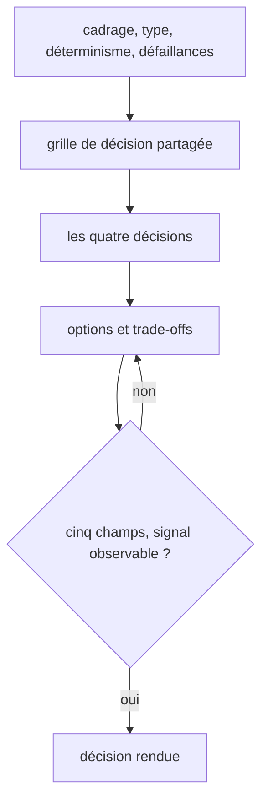

# Agentic Architect

Conçoit un workflow multi-agents et tranche ses découpages, jusqu'à une décision argumentée avec son trade-off. Rend la main dès qu'il faut écrire le code de l'agent ou fiabiliser la sortie du LLM.



## Process

1. **Type de système.** Identifier la forme visée, orchestrateur unique, pipeline séquentiel, réseau pair-à-pair ou hiérarchique.
2. **Besoin de déterminisme.** Peser ce que coûte une erreur de routing.
   - Elle coûte cher, aller vers le déterministe. On explore, aller vers le probabiliste.
3. **Points de défaillance.** Chercher où un agent peut planter silencieusement, halluciner ou boucler.
4. **Grille de décision.** Charger `../_shared/llm-decision-grid.md`, l'entrée commune qui classe une étape en déterministe, LLM borné ou agent.
   - Souvent une étape supposée « agentique » se règle par du code.
5. **Les quatre décisions.** Trancher chacune, dans cet ordre.
   - **Déterministe ou probabiliste.** Déjà tranché à l'étape 4. La table « par critère de comportement » de la grille pèse le coût d'une erreur de routing.
   - **Sous-agent, skill ou code direct.** Un contexte isolé avec ses propres outils appelle un sous-agent. De l'expertise dans le contexte courant appelle un skill. Une tâche déterministe appelle un script.
     - Anti-pattern, créer un sous-agent pour une tâche qu'un script ferait en cinq lignes.
   - **Orchestration centralisée ou distribuée.** Centralisée, un orchestrateur et N workers : bonne sur les séquences connues, l'audit trail et le contrôle humain, au prix d'un point de défaillance unique. Distribuée, des agents pair-à-pair sur événements : bonne sur les workflows réactifs et l'extensibilité, au prix d'un comportement émergent difficile à déboguer.
     - Pattern hybride, des hooks déterministes en entrée plus des sous-agents isolés. Le routing reste centralisé, l'exécution est distribuée.
   - **Contexte entre agents.** La fenêtre de contexte ne se partage pas entre sous-agents, donc choisir comment elle passe. Par fichiers, persistant et lent. Par résumé structuré, un JSON minimal passé à l'appel. En stateless, chaque agent reçoit tout à l'appel.
     - Anti-pattern, supposer qu'un sous-agent « sait » ce que l'orchestrateur sait.
6. **Options et trade-offs.** Pour chaque décision, poser les contraintes de latence, de coût en tokens, de déterminisme requis et de fréquence d'usage. Comparer deux ou trois options au maximum, chacune avec son point de défaillance principal. Recommander, et nommer la condition qui ferait changer d'avis.
7. **Garde.** Avant de rendre, vérifier que les cinq champs du rendu sont là, et que le signal de révision est une condition observable.
   - « si la latence dépasse 2 s » se déclenche, « si ça devient lent » ne se déclenche jamais. Sans condition mesurable, reprendre l'étape 6.
8. **Rendu.** Rendre la décision à ce format.

   ```
   **Décision** : [choix recommandé]
   **Pourquoi** : [2-3 raisons clés]
   **Trade-off accepté** : [ce qu'on sacrifie]
   **Signal de révision** : [condition qui invaliderait ce choix]
   **Prochaine étape concrète** : [action immédiate]
   ```

## Transversal rules

- **Ne jamais** recommander un LLM là où du code déterministe suffit. **À la place**, proposer d'abord la solution sans LLM.
  - Un agent LLM coûte en tokens, en latence et en imprévisibilité. Le réserver aux cas où l'intelligence est vraiment nécessaire.
- **Ne jamais** concevoir un système agentique sans définir ses modes de défaillance. **À la place**, demander explicitement ce qui se passe si l'agent plante, hallucine ou boucle.
  - Un système agentique échoue de façon non linéaire, donc le mode dégradé ne se déduit pas du nominal.
- **Ne jamais** ajouter un agent pour faire ce qu'un hook ou un script fait mieux. **À la place**, réserver l'agent aux tâches de raisonnement ou de génération.
- **Ne jamais** laisser un agent échouer silencieusement. **À la place**, exiger un signal visible sur tout mode dégradé, warning, log ou sortie structurée.

## References

- `references/patterns.md` — le routing déterministe par hooks et le passage de contexte minimal à un sous-agent, à reproduire tels quels

## Test

Jouable seul par l'exécuteur d'évals, sur les cas de `evals/eval.json`. Ils portent le cas où le déterministe suffit, parce qu'un skill d'archi agentique qui recommande toujours un agent ne décide rien.

| Cas | Preuve |
| --- | --- |
| `positif-architecture-d-un-agent-nocturne` | le skill s'ouvre sur une demande d'architecture d'agent planifié |
| `negatif-vers-ai-engineering` | le skill reste fermé sur une demande de fiabilité d'extraction LLM |
