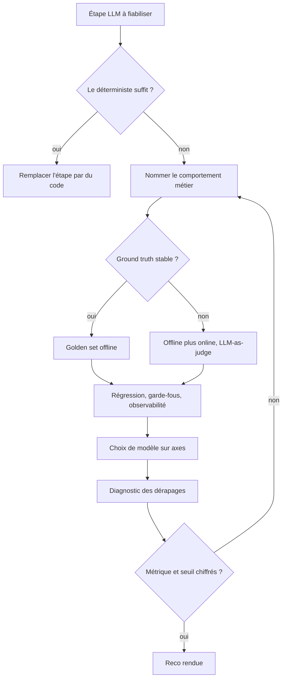

# Skill — AI Engineering

Décider la méthodo d'évaluation, de fiabilité et de choix de modèle d'une app qui *utilise* un LLM, puis rendre la main sur la reco. Ce skill ne code pas.



## Process

1. **Garde.** Charger `../_shared/llm-decision-grid.md` et trancher si l'étape a vraiment besoin d'un LLM.
   - Beaucoup de « problèmes de fiabilité LLM » se règlent en remplaçant l'étape par du code. Quand c'est le cas, le dire et s'arrêter là.
2. **Nommer le comportement métier attendu.** C'est lui qu'on évalue, jamais l'implémentation.
3. **Choisir la stratégie d'évaluation.** Elle se déduit de la stabilité du ground truth.
   - **Ground truth stable** : golden set de cas réels, en visant 500 à 1 000 exemples dès qu'il faut juger un LLM-judge.
   - **Tâche ouverte** : eval offline en dev et en CI, plus eval online en prod.
   - **Pas de réponse exacte attendue** : LLM-as-judge, validé à 75-90 % d'accord avec des labels humains avant de le passer à l'échelle. Les humains restent arbitres sur échantillon.
   - **Boucler** : lancer, ajuster, relancer. Piège connu, améliorer un prompt en régresse un autre, et seul un golden set le voit.
4. **Verrouiller la régression de prompt et de modèle.**
   - Un prompt est du code : il se versionne et se hashe.
   - La CI rejoue l'eval sur le golden set, et le merge se bloque dès que le score passe sous la baseline.
   - **Version drift** : le fournisseur met à jour le modèle en silence, donc la régression arrive sans le moindre changement de code. La réponse est de pinner la version, en test comme en prod, et de rejouer l'eval périodiquement.
5. **Poser les garde-fous d'implémentation.**
   - `temperature = 0` en test, pour la reproductibilité.
   - Valider la sortie structurée contre un schéma JSON, avec retry puis fallback déterministe.
   - Ne jamais logguer de PII (donnée personnelle identifiante) brute dans les prompts ni dans les traces.
6. **Câbler l'observabilité et le coût.**
   - Le monitoring classique ne suffit pas : un mauvais output ne produit aucune stack trace. Logguer entrée, sortie, tokens, latence et coût, puis tracer.
   - Décomposer le coût par span, par trace et par outil. Un RAG (génération augmentée par la recherche) fait fortement varier le nombre de tokens.
7. **Arbitrer le choix de modèle sur des axes, jamais sur un classement daté.**
   - **Précision** : le modèle atteint-il le seuil métier sur ton propre golden set ?
   - **Coût** : les tokens multipliés par le volume restent-ils tenables à l'échelle ?
   - **Latence** : le budget temps par requête.
   - **Privacy et souveraineté** : une donnée sensible pousse vers le local plutôt que vers une API.
   - **Local ou API** : infra et contrôle d'un côté, simplicité et capacité de l'autre. Cet axe est orthogonal à l'agentivité.
   - Récupérer les chiffres du jour par la recherche de doc et la recherche web natives, jamais de mémoire. **POURQUOI** : benchmarks et prix pourrissent en semaines, donc un chiffre daté affirmé fait décider sur du faux.
   - Les critères de cette étape et des précédentes viennent d'un panorama vérifié sur 9 sources : taxonomies arxiv, golden dataset, LLM-as-judge, LLMOps et CI, root-cause d'hallucination.
8. **Diagnostiquer quand la sortie dérape.**
   - Une hallucination n'est pas de l'aléatoire. C'est le symptôme d'un défaut en amont, dans le retrieval, dans le prompt ou dans la donnée. Diagnostiquer le pipeline au lieu de patcher la sortie.
   - **Tool-call plausible mais faux**, quand l'app est agentique : l'appel a l'air correct et fait la mauvaise chose. Il reste invisible aux asserts classiques, et se détecte par une eval de son effet.
9. **Garde.** Ne pas rendre la reco tant que la stratégie d'éval ne nomme pas une métrique **et** un seuil chiffré.
   - **POURQUOI** : une stratégie sans seuil ne peut jamais échouer, donc elle n'évalue rien.
10. **Rendre la reco** sur ce format, les six champs remplis.

```
**Comportement métier visé** : ce qu'on évalue, pas l'implémentation
**Stratégie d'éval** : golden set, LLM-judge ou online, avec sa métrique et son seuil
**Garde-fous** : validation de sortie, température, version pinnée
**Coût/risque accepté** : le trade-off assumé
**Signal de révision** : score sous la baseline, drift de modèle
**Prochaine étape concrète** : l'action immédiate
```

## Transversal rules

- La sortie d'un LLM est probabiliste. On ne la répare pas, on construit un système qui marche malgré elle.
- Ne jamais valider une feature LLM sur « ça a marché trois fois ». Exiger un golden set et un seuil. **POURQUOI** : trois succès ne disent rien de la distribution.
- Ne jamais asserter l'égalité exacte d'une sortie LLM. Passer par une métrique et un seuil, ou par un LLM-judge. **POURQUOI** : le test casse à la première reformulation non significative.
- Ne jamais mettre un LLM là où une étape déterministe est assez bonne. **POURQUOI** : coût, latence et imprévisibilité se paient à chaque exécution.
- Ne jamais laisser une sortie LLM non validée atteindre un effet de bord. **POURQUOI** : la dégradation passe alors en silence, sans rien à observer après coup.
- La fiabilité d'une sortie LLM est orthogonale à l'agentique. Ce skill est la fondation, `agentic-architect` traite la structure posée au-dessus.

## Test

Le déclenchement se joue par `evals/eval.json`, outils coupés. La dernière ligne est une relecture humaine de la reco rendue.

| Cas | Preuve |
| --- | --- |
| jouer le cas positif d'`evals/eval.json` | le skill s'ouvre sur une mise en prod appuyée sur trois essais |
| jouer les trois cas négatifs d'`evals/eval.json` | le skill reste fermé, orchestration, fuite de secret et review de code partant chez leur frère |
| relire la reco rendue | les six champs du format sont présents |
