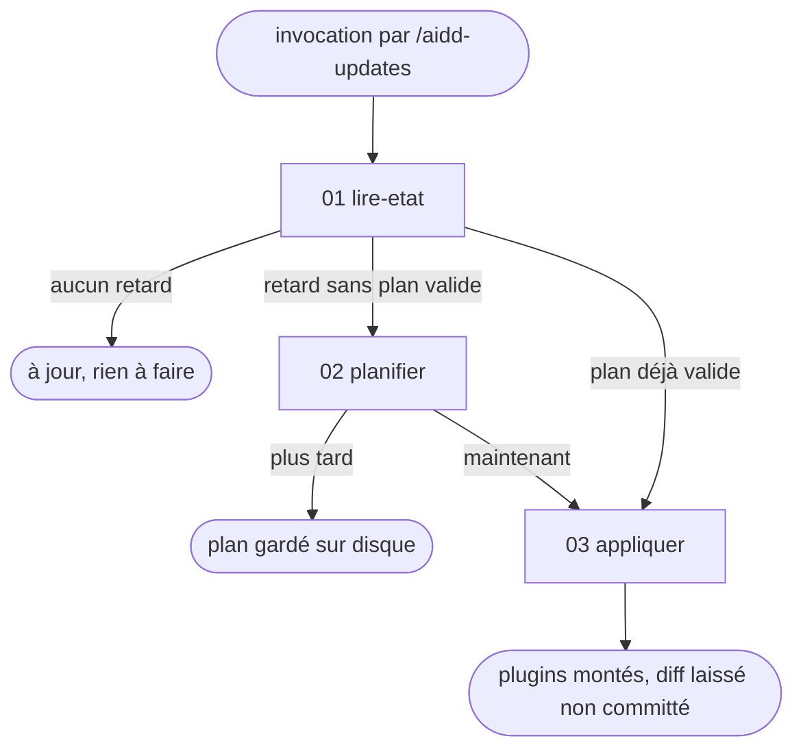

# aidd-updates — décider d'une montée de version AIDD en connaissance de cause

Claude Code sait appliquer une mise à jour de plugin, pas te dire ce qu'elle va casser. Le risque
n'est pas la montée elle-même, c'est que 16 noms de skills AIDD soient cités dans ce repo et qu'un
renommage upstream les rende muets sans erreur visible. Ce skill produit la décision, pas la mise à
jour.

## Actions

Dérouler le flux. Ne lire que la prochaine action.

| Action | Fait |
| --- | --- |
| lire-etat | interroge le détecteur, puis branche entre à jour, plan valide et à planifier |
| planifier | lit les changelogs des versions sautées, prouve les patchs par grep, écrit le plan |
| appliquer | monte les plugins, applique les patchs, propose l'entrée de `CHANGELOG-aidd.md` |

## Transversal rules

- **Ne jamais écrire le front-matter du fichier d'état à la main.** Passer par les commandes du
  détecteur (`references/detecteur.md`).
  *Pourquoi : un front-matter cassé par une édition libre rend le même symptôme qu'un plan absent, et
  le skill replanifierait à chaque appel sans que rien ne dise pourquoi.*
- **Ne jamais lancer la montée de version sans un plan validé par l'humain**, même quand le changelog
  paraît anodin.
  *Pourquoi : c'est exactement le comportement de l'auto-update, que ce montage existe pour remplacer.*
- **Un renommage se prouve par un grep, pas par une lecture de changelog.** Citer le fichier et la
  ligne, jamais « il faudra vérifier les appels ».
  *Pourquoi : un plan qui dit « vérifier » renvoie le travail à l'humain, alors qu'il déléguait pour
  s'en débarrasser.*
- **Ce qui n'est pas cité dans ce repo ne va pas au plan.** Une nouveauté upstream sans impact ici se
  résume en une ligne, sans devenir une tâche.
  *Pourquoi : 16 versions de changelog produisent des dizaines de changements, dont une poignée nous
  concerne. Tout lister noie la seule ligne qui compte.*

## References

- `references/detecteur.md` — l'emplacement du détecteur, ses quatre commandes, et les champs d'état qui portent une décision

## Assets

- `assets/gabarit-plan.md` — le corps du plan d'adaptation, injecté dans le fichier d'état par l'action `planifier`

## Test

Une batterie jouable seule pour la donnée, le reste en relecture humaine du run déroulé.

| Cas | Preuve |
| --- | --- |
| `bash wrappers/claude/scripts/tests/test-aidd-updates.sh` | la batterie du détecteur passe au vert, branches d'état comprises |
| une machine sans retard | le skill dit « à jour » et s'arrête sans ouvrir un seul changelog |
| un plan sur disque encore valide | le skill l'affiche tel quel, il ne replanifie pas |
| une rupture upstream sans occurrence ici | elle sort en une ligne du plan, jamais en tâche |
| aucun accord humain dans le tour courant | aucune commande `claude plugin update` n'est lancée |
