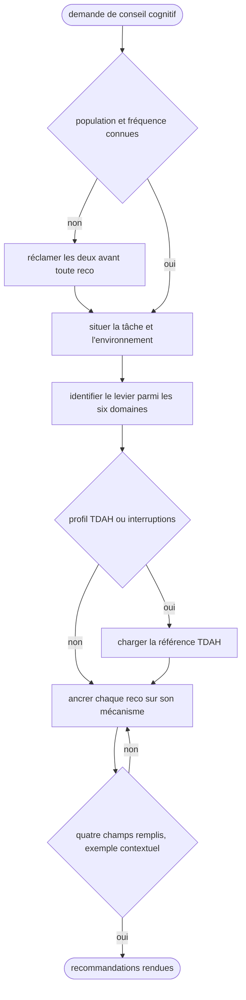

# Skill — Brain Expert

Traduire ce qu'on sait du cerveau humain en décisions concrètes de système, d'UX, de workflow ou de documentation, et rendre la main une fois les recommandations posées.



## Process

1. **Garde.** Réclamer la population visée et la fréquence d'usage quand elles ne sont pas données, avant toute recommandation.
   - Le même écran se conçoit à l'opposé pour un expert quotidien et pour un novice occasionnel.
   - Piste donnée d'avance sans population connue : la différencier par profil, au lieu de trancher pour l'un des deux.
2. **Situer la tâche et l'environnement d'usage.** Stress, interruption, temps limité.
3. **Identifier le levier cognitif principal** parmi les six domaines.
   - **Mémoire de travail.** Capacité limitée, environ 4 chunks. La surcharge produit des erreurs et de l'abandon. Chunker par groupes de 3 à 4, externaliser en listes visuelles plutôt qu'en mémorisation, n'afficher que ce qu'exige l'étape courante.
   - **Attention.** Sélective par filtrage, soutenue dans la durée, divisée en multi-tâche, ce dernier étant un mythe. Signal visuel fort sur ce qui compte, distracteurs éliminés des flows critiques, 20 à 45 minutes avant le besoin de pause.
   - **Charge cognitive.** Trois composantes : intrinsèque, la complexité du sujet, extrinsèque, l'interface, et germane, l'apprentissage. Réduire l'extrinsèque sans toucher à l'intrinsèque, poser des affordances claires, rendre les erreurs récupérables par undo ou confirmation.
   - **Apprentissage et rétention.** Courbe d'Ebbinghaus : l'oubli est rapide sans répétition espacée. Préférer la répétition espacée à la relecture passive, la génération active à la consommation, et alterner les types de tâches.
   - **Motivation et récompense.** La dopamine porte l'anticipation de la récompense, pas la récompense elle-même. Feedback immédiat même sur une micro-action, progression visible par barre ou compteur, autonomie perçue par le choix laissé.
   - **Biais et heuristiques.** Le cerveau prend des raccourcis, et les connaître permet de les anticiper. Primauté et récence placent le critique au début et à la fin, le biais de confirmation se challenge activement, et au-delà de 5 à 7 options le choix paralyse.
4. **Charger `references/adhd-patterns.md`** quand le contexte implique un profil TDAH ou une forte sensibilité aux interruptions.
5. **Ancrer chaque recommandation.** Citer le mécanisme cognitif en jeu, donner un exemple pris dans le contexte du projet, nommer le trade-off.
6. **Rendre au format à quatre champs.**

   ```
   **Problème cognitif** : [mécanisme identifié]
   **Impact** : [ce que ça coûte à l'utilisateur]
   **Recommandation** : [action concrète]
   **Exemple** : [appliqué au contexte]
   ```

7. **Garde de sortie.** Ne rien rendre avant que les quatre champs soient remplis et que l'exemple nomme un élément du contexte soumis.
   - Un exemple qui marcherait pour n'importe quelle interface ne prouve pas que le mécanisme a été identifié : retour à l'étape 5.

## Transversal rules

- **Ne jamais conclure sans connaître la population visée et la fréquence d'usage.** À la place, poser la question. La charge cognitive s'optimise à l'opposé selon le profil, un raccourci qui sauve l'expert piégeant le novice. Une reco posée sur une population supposée n'est vraie que par accident.
- **Ne jamais donner une recommandation sans citer le mécanisme cognitif.** À la place, ancrer chaque conseil dans une réalité neuroscientifique, même simplifiée. Sans ça, le « bon sens » non fondé passe, et il est parfois contre-productif.
- **Ne jamais optimiser pour la cognition au détriment de la valeur fonctionnelle.** À la place, identifier le trade-off et laisser le choix. Simplifier à l'extrême vide un outil de sa substance.
- **Ne jamais extrapoler vers le diagnostic clinique.** À la place, rester sur les patterns comportementaux observables et mesurables. C'est hors compétence, donc le risque est la désinformation.

## References

- `references/adhd-patterns.md` — le profil cognitif TDAH et ses patterns de conception, chargé à la demande

## Test

Le déclenchement est jouable seul par l'exécuteur d'évals, `evals/eval.json`. La qualité de la sortie se relit à la main.

| Cas | Preuve |
| --- | --- |
| cas `positif-charge-cognitive-d-un-ecran` | le skill part, le registre de la session le nomme |
| cas `negatif-a11y-frontend-hors-domaine` | le skill ne part pas |
| relecture d'une réponse rendue | les quatre champs du format sont présents, et l'exemple nomme un élément du contexte soumis |
