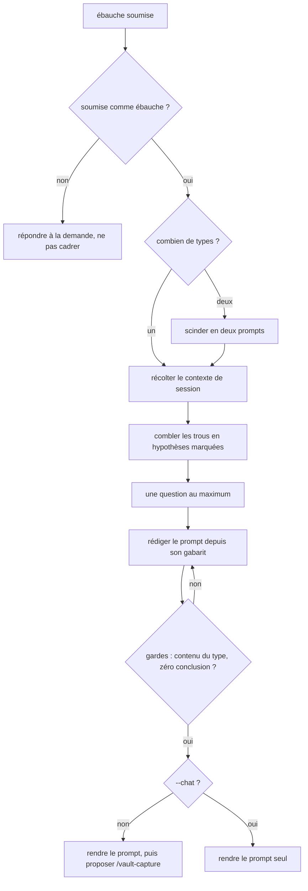

# cadre-prompt

Prend une ébauche de demande et rend un prompt cadré. Le gabarit des trois formes vit dans
[`assets/squelette-prompt.md`](assets/squelette-prompt.md), le corps ci-dessous porte la méthode.

> [!important] Ne jamais cadrer une demande qui n'a pas été soumise comme ébauche
> Une demande ordinaire, même mal formulée, s'exécute ou se répond. Elle ne se reformule pas.
> *Pourquoi : détourner une demande normale en questionnaire remplace la réponse attendue par du
> travail administratif, et c'est le seul vrai risque de ce skill.*

## Process

1. **Vérifier le déclencheur.** L'utilisateur soumet-il un texte *comme* ébauche à cadrer ?
   - Si non, ne pas cadrer, répondre à sa demande.
2. **Détecter le type.** L'objectif est presque toujours présent dans une ébauche, ce qui manque est
   **où ça s'arrête et ce qu'on fait du résultat**.
   - Le type se reconnaît à ce tableau, et il décide de ce que le prompt doit gagner.

     | Type | Ce qui le reconnaît | Ce qui manque presque toujours | Ce que le prompt gagne |
     |---|---|---|---|
     | **Exécution** | un verbe d'action sur un objet identifié | de quoi savoir que c'est fini | des critères d'acceptation vérifiables, et ce qu'on ne touche pas |
     | **Analyse** | une ou plusieurs questions dont la réponse est un document | la borne | un contrat de questions figé, son hors-périmètre, et le livrable nommé |
     | **Exploration** | des questions ouvertes empilées, sans dire ce qu'on en fera | la condition d'arrêt | un budget, un « ne conclus pas », et la consigne de capturer les découvertes hors contrat |

   - **L'exploration est le type qu'on n'écrit jamais, et le plus coûteux.** Une règle de réponse
     saine demande à l'agent de ne pas freiner pendant une exploration. Sans borne déclarée, il ne
     s'arrête donc pas, et l'échange part en tunnel. *Pourquoi le nommer explicitement : le manque
     n'est pas une maladresse d'écriture, c'est une borne absente, et aucune relecture de style ne
     la fait apparaître.*
   - **Deux types dans une même ébauche se scindent, ils ne s'arbitrent pas.** Rendre deux prompts.
     *Pourquoi : un prompt mixte fait exécuter pendant l'exploration, ou explorer pendant
     l'exécution.*
3. **Récolter le contexte de session**, seulement s'il y en a. Deux natures, et une seule interdite.
   - Les **faits mesurés**, chacun avec la commande ou la source qui l'a produit.
   - Les **prémisses fausses** rencontrées, y compris et surtout les erreurs de l'agent lui-même.
   - ⛔ **Jamais les conclusions, recommandations ou arbitrages de la session.** *Pourquoi : un fait
     mesuré se réfute en une commande, une conclusion se contente d'être crue. Transportée, elle fait
     ratifier par la session neuve ce qu'elle devait tester.*
4. **Combler les trous par des hypothèses marquées**, jamais par une question. Chaque hypothèse porte
   le préfixe `⚠️ supposé :` et atterrit dans la section finale du prompt. *Pourquoi : une hypothèse
   fausse et visible se corrige en une ligne, une question bloque la production.*
5. **Poser une question, au maximum, et seulement si la réponse change la sortie.** Sinon aucune.
   *Pourquoi : le budget d'attention de l'utilisateur est la ressource rare de l'échange, et un
   questionnaire le dépense avant que le travail commence.*
6. **Rédiger le prompt** à partir du gabarit de son type, en bloc de code copiable.
   - **Garde.** Un type « exploration » porte une condition d'arrêt explicite, un type « analyse » un
     hors-périmètre non vide, un type « exécution » des critères d'acceptation vérifiables. Il
     manque l'un des trois, retourner à la rédaction.
   - **Garde.** Relire la sortie en cherchant les verbes de décision (« il faut », « je propose »,
     « donc on »), et retirer ce qu'ils portent. Aucune conclusion de la session en cours n'entre
     dans le prompt.
7. **Rendre**, une fois le prompt rédigé et pas avant. Deux branches, et la première est le défaut.
   - Afficher le prompt, puis proposer un titre court et dire de lancer `/vault-capture` pour le poser
     dans l'inbox.
   - **`--chat` dans les arguments** → afficher le prompt seul, sans proposer la capture. Pour un
     petit prompt qu'on relance tout de suite.
   - **Ce skill n'ouvre pas `vault-capture` lui-même, et la proposition n'est pas une politesse.**
     *Pourquoi, tranché le 2026-08-27 : les deux skills sont à invocation manuelle, et un skill manuel
     n'est ouvrable que par l'humain. La R13 de `skill-craft` porte la mesure. La délégation que cette
     étape promettait ne pouvait donc pas avoir lieu.*

## Transversal rules

- **L'inbox du vault est la destination par défaut, et l'écriture appartient à `vault-capture`.** Ce
  skill ne l'écrit jamais lui-même. *Pourquoi : la résolution de la racine absolue et le garde-fou
  « vault absent » vivent là-bas. Les recopier ici serait le doublon qu'interdit la R6 de
  `skill-craft`, et c'est la dérive que sa convention annonce comme invisible au lint.*
- **Ce skill n'écrit jamais, quelle que soit la branche.** Le prompt sort dans la conversation, et le
  vault n'est touché que par l'invocation suivante, celle de l'utilisateur.
- **Il reste à invocation manuelle bien qu'il n'écrive rien.** *Pourquoi : une demande vague ressemble
  à une ébauche, donc un déclenchement au flair cadrerait ce que l'utilisateur voulait voir exécuté.
  L'étape 1 porte déjà cette garde en prose, et le champ la rend déterministe. C'est le motif
  « contrôle du moment » de la R13 de `skill-craft`.*
- **Le prompt cite des chemins, jamais des résumés de fichiers.** *Pourquoi : un résumé périme sans
  le dire, un chemin se relit.*
- **Ce qui est mesuré et ce qui est supposé restent visuellement distincts** dans le prompt produit.
  *Pourquoi : un doute non signalé se lit comme une affirmation, et la session neuve le propagera.*
- **Le prompt nomme le mode d'exécution attendu** quand il en dépend, par exemple le plan mode pour
  une analyse qui conclura sur des modifications. *Pourquoi : sans lui, l'agent enchaîne sur les
  éditions au lieu de faire valider l'approche.*

## Assets

- [`assets/squelette-prompt.md`](assets/squelette-prompt.md) — les trois gabarits de prompt, un par
  type de demande, avec leurs conditions d'omission

## Test

Scénarios dans [`evals/eval.json`](evals/eval.json), tous négatifs : le skill étant à invocation
manuelle, le contrat qui compte pour lui est de ne jamais partir tout seul. Le reste se constate sur
la sortie d'un run.

| Cas | Preuve |
| --- | --- |
| les cas d'`evals/eval.json`, joués outils coupés | aucun des trois frères cités en clause NE PAS n'ouvre `cadre-prompt` |
| grep du préfixe `⚠️ supposé :` sur le prompt rendu | autant de lignes que la section finale compte d'hypothèses |
| compter les questions qui accompagnent la sortie | une au maximum, deux ou plus est un échec de l'étape 5 |
| comparer les sections du prompt à celles du gabarit de son type | toutes présentes, aux seules omissions que le gabarit autorise |
| `git status` dans le repo courant après un run, quelle que soit la branche | vide, l'écriture n'ayant lieu que par `vault-capture` |

Ce qui **échoue ouvert** ne se teste pas, et se relit à la main : la passation en fin de session
riche, où le skill transporte volontiers les conclusions de la session en produisant une sortie
parfaitement plausible. Relire la sortie contre le ⛔ de l'étape 3 avant de capturer.
