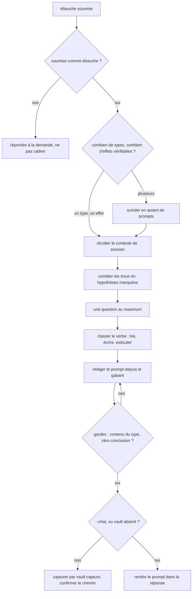

# cadre-prompt

Prend une ébauche de demande et rend un prompt cadré. Le gabarit unique, six briques (contexte, effet,
périmètre, contraintes, libre, fini quand), vit dans
[`assets/squelette-prompt.md`](assets/squelette-prompt.md), le corps ci-dessous porte la méthode.

> [!important] Ne jamais cadrer une demande qui n'a pas été soumise comme ébauche
> Une demande ordinaire, même mal formulée, s'exécute ou se répond. Elle ne se reformule pas.
> *Pourquoi : détourner une demande normale en questionnaire remplace la réponse attendue par du
> travail administratif, et c'est le seul vrai risque de ce skill.*

```mermaid
flowchart TD
  A[ébauche soumise] --> B{soumise comme ébauche ?}
  B -->|non| Z[répondre à la demande, ne pas cadrer]
  B -->|oui| C{combien de types, combien d'effets vérifiables ?}
  C -->|plusieurs| D[scinder en autant de prompts]
  C -->|un type, un effet| E[récolter le contexte de session]
  D --> E
  E --> F[combler les trous en hypothèses marquées]
  F --> G[une question au maximum]
  G --> V[classer le verbe : lire, écrire, exécuter]
  V --> H[rédiger le prompt depuis le gabarit]
  H --> I{gardes : contenu du type, zéro conclusion ?}
  I -->|non| H
  I -->|oui| J{--chat, ou vault absent ?}
  J -->|non| K[capturer par vault-capture, confirmer le chemin]
  J -->|oui| L[rendre le prompt dans la réponse]
```

## Process

1. **Vérifier le déclencheur.** L'utilisateur soumet-il un texte *comme* ébauche à cadrer ?
   - Si non, ne pas cadrer, répondre à sa demande.
2. **Détecter le type.** L'objectif est presque toujours présent dans une ébauche, ce qui manque est
   **où ça s'arrête et ce qu'on fait du résultat**.
   - Le type se reconnaît à ce tableau. Il ne choisit pas un gabarit, il décide de ce que chaque
     brique du gabarit unique porte (tableau « par type » de `squelette-prompt.md`).

     | Type | Ce qui le reconnaît | Ce qui manque presque toujours | Ce que le prompt gagne |
     |---|---|---|---|
     | **Exécution** | un verbe d'action sur un objet identifié | de quoi savoir que c'est fini | des critères d'acceptation vérifiables, et ce qu'on ne touche pas |
     | **Analyse** | une ou plusieurs questions dont la réponse est un document | la borne | un contrat de questions figé, son hors-périmètre, et le livrable nommé |
     | **Exploration** | des questions ouvertes empilées, sans dire ce qu'on en fera | la condition d'arrêt | un budget, un « ne conclus pas », et la consigne de capturer les découvertes hors contrat |

   - **L'exploration est le type qu'on n'écrit jamais, et le plus coûteux.** Une règle de réponse
     saine demande à l'agent de ne pas freiner pendant une exploration. Sans borne déclarée, il ne
     s'arrête donc pas, et l'échange part en tunnel. *Pourquoi le nommer explicitement : le manque
     n'est pas une maladresse d'écriture, c'est une borne absente, et aucune relecture de style ne
     la fait apparaître.*
   - **Deux types dans une même ébauche se scindent, ils ne s'arbitrent pas.** Rendre deux prompts.
     *Pourquoi : un prompt mixte fait exécuter pendant l'exploration, ou explorer pendant
     l'exécution.*
   - **Même chose pour deux effets vérifiables dans un seul type** : une tâche, une session, un effet.
     « Une application de réservation » devient un prompt par morceau (comptes, agenda, paiement).
     *Pourquoi : une demande trop grosse laisse l'IA choisir seule le découpage, et ce choix ne se
     relit pas.*
3. **Récolter le contexte de session**, seulement s'il y en a. Deux natures, et une seule interdite.
   - Les **faits mesurés**, chacun avec la commande ou la source qui l'a produit.
   - Les **prémisses fausses** rencontrées, y compris et surtout les erreurs de l'agent lui-même.
   - ⛔ **Jamais les conclusions, recommandations ou arbitrages de la session.** *Pourquoi : un fait
     mesuré se réfute en une commande, une conclusion se contente d'être crue. Transportée, elle fait
     ratifier par la session neuve ce qu'elle devait tester.*
4. **Combler les trous par des hypothèses marquées**, jamais par une question. Chaque hypothèse porte
   le préfixe `⚠️ supposé :` et atterrit dans la section finale du prompt. *Pourquoi : une hypothèse
   fausse et visible se corrige en une ligne, une question bloque la production.*
5. **Poser une question, au maximum, et seulement si la réponse change la sortie.** Sinon aucune.
   *Pourquoi : le budget d'attention de l'utilisateur est la ressource rare de l'échange, et un
   questionnaire le dépense avant que le travail commence.*
6. **Classer le verbe** de l'ébauche, il fixe ce que l'IA a le droit de faire.
   - **Lire** (expliquer, analyser, comparer) : aucun risque.
   - **Écrire** (proposer, modifier, corriger) : annulable avec git.
   - **Exécuter** (supprimer, déployer, migrer) : parfois sans retour, le prompt demande un commit avant.
   - Le verbe retenu ouvre le prompt. Un verbe d'écriture sur une ébauche qui voulait comprendre se
     corrige en verbe de lecture (« ne modifie rien »). *Pourquoi : « corrige le calcul » quand on
     voulait d'abord comprendre le bug fait écrire à l'agent ce qu'on ne lui avait pas demandé.*
7. **Rédiger le prompt** à partir du gabarit, en bloc de code copiable.
   - **Garde.** Un type « exploration » porte une condition d'arrêt explicite, un type « analyse » un
     hors-périmètre non vide, un type « exécution » des critères d'acceptation vérifiables et la
     boucle « teste, compare, recommence ». Il manque l'un des trois, retourner à la rédaction.
   - **Garde.** La brique « Libre » est écrite. Elle ne porte que ce que l'utilisateur n'a pas défini :
     l'IA choisit librairies et procédure seulement là où il n'a rien dit.
   - **Garde.** La stack, les conventions et la procédure que l'utilisateur a nommées passent en
     « Contraintes », telles quelles, sans les assouplir. Le skill n'en invente aucune : pas de
     librairie, de signature ou de numéro de ligne que l'ébauche ne donne pas. *Pourquoi : un profil
     technique ou un projet à stack imposée a besoin de contrôler le comment, et trop de contraintes
     inventées font obéir l'agent sans réfléchir, puis casser au premier imprévu.*
   - **Garde.** Relire la sortie en cherchant les verbes de décision (« il faut », « je propose »,
     « donc on »), et retirer ce qu'ils portent. Aucune conclusion de la session en cours n'entre
     dans le prompt.
8. **Capturer**, une fois le prompt rédigé et pas avant. Trois branches, et la première est le défaut.
   *Pourquoi cet ordre : le repli garde ainsi toujours un prompt à afficher, au lieu de perdre le
   travail avec la délégation.*
   - Ouvrir `vault-capture` avec le prompt et un titre court, puis confirmer le chemin absolu créé.
   - **`--chat` dans les arguments** → sauter la capture, rendre le prompt dans la réponse. Pour un
     petit prompt qu'on relance tout de suite.
   - **`vault-capture` s'arrête sur son garde-fou** (vault absent) → rendre le prompt dans la réponse,
     en disant que la capture n'a pas eu lieu.

## Transversal rules

- **Le prompt part dans l'inbox du vault par défaut, et l'écriture appartient à `vault-capture`.** Ce
  skill ne l'écrit jamais lui-même. *Pourquoi : la résolution de la racine absolue et le garde-fou
  « vault absent » vivent là-bas. Les recopier ici serait le doublon qu'interdit la R6 de
  `skill-craft`, et c'est la dérive que sa convention annonce comme invisible au lint.*
- **`--chat` n'écrit rien.** Le prompt sort dans la conversation, et le vault n'est pas touché.
- **Le prompt cite des chemins, jamais des résumés de fichiers.** *Pourquoi : un résumé périme sans
  le dire, un chemin se relit.*
- **Ce qui est mesuré et ce qui est supposé restent visuellement distincts** dans le prompt produit.
  *Pourquoi : un doute non signalé se lit comme une affirmation, et la session neuve le propagera.*
- **Une information qui revient d'une ébauche à l'autre se propose en une ligne dans la réponse**
  pour descendre au fichier projet ou au `CLAUDE.md`, jamais dans le prompt. *Pourquoi : les trois
  étages du contexte (tâche, projet, permanent) évitent de la réécrire à chaque prompt.*
- **Le prompt nomme le mode d'exécution attendu** quand il en dépend, par exemple le plan mode pour
  une analyse qui conclura sur des modifications. *Pourquoi : sans lui, l'agent enchaîne sur les
  éditions au lieu de faire valider l'approche.*

## Assets

- [`assets/squelette-prompt.md`](assets/squelette-prompt.md) — le gabarit unique à six briques, avec
  ce que chaque brique porte selon le type, et ses conditions d'omission

## Test

Scénarios dans [`evals/eval.json`](evals/eval.json), tous négatifs : le skill étant à invocation
manuelle, le contrat qui compte pour lui est de ne jamais partir tout seul. Le reste se constate sur
la sortie d'un run.

| Cas | Preuve |
| --- | --- |
| les cas d'`evals/eval.json`, joués outils coupés | aucun des trois frères cités en clause NE PAS n'ouvre `cadre-prompt` |
| grep du préfixe `⚠️ supposé :` sur le prompt rendu | autant de lignes que la section finale compte d'hypothèses |
| compter les questions qui accompagnent la sortie | une au maximum, deux ou plus est un échec de l'étape 5 |
| comparer les sections du prompt aux six briques du gabarit | toutes présentes, aux seules omissions que le gabarit autorise |
| chercher `## Libre` dans le prompt rendu | présente, jamais omise |
| lire la première ligne du prompt rendu | un mode lire, écrire ou exécuter, et « commit avant » si exécuter |
| ébauche à deux effets vérifiables | deux prompts rendus, pas un |
| `git status` dans le repo courant après un run, quelle que soit la branche | vide, l'écriture n'ayant lieu que par `vault-capture` |

Ce qui **échoue ouvert** ne se teste pas, et se relit à la main : la passation en fin de session
riche, où le skill transporte volontiers les conclusions de la session en produisant une sortie
parfaitement plausible. Relire la sortie contre le ⛔ de l'étape 3 avant de capturer.
