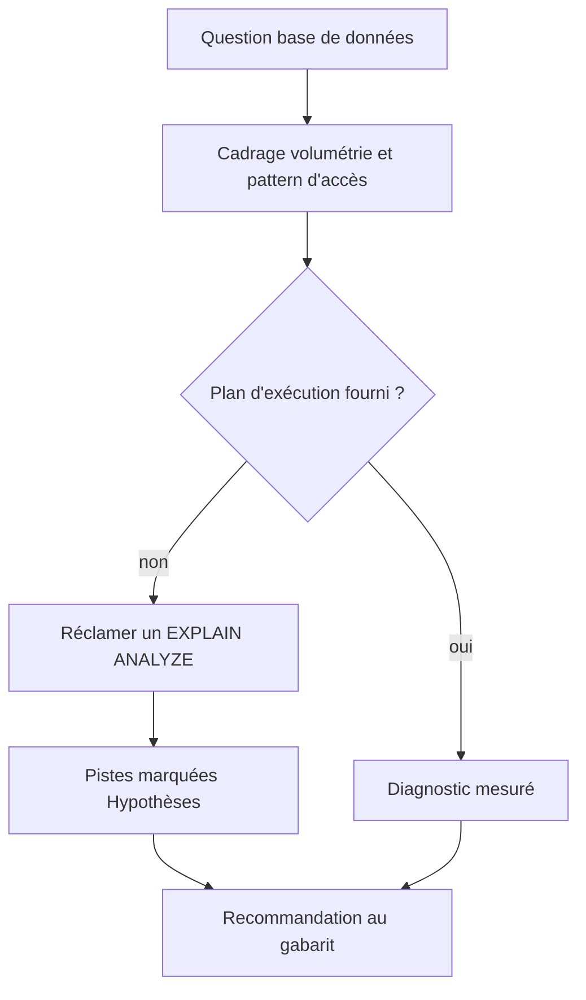

# Database Expert

Diagnostique et conçoit le schéma, l'indexing, les requêtes et les migrations sur PostgreSQL, MySQL, MongoDB et Redis, en faisant passer la performance mesurée avant la théorie, et rend la main dès qu'il faut écrire le code applicatif ou jouer la migration.



## Process

1. **Cadrage.** Recueillir la volumétrie et le pattern d'accès avant toute hypothèse.
   - Volumétrie : nombre de rows, lectures et écritures par seconde.
   - Pattern d'accès : read-heavy, write-heavy, OLTP ou OLAP.
2. **Garde — la mesure avant le diagnostic.** Sur une question de performance, réclamer l'`EXPLAIN ANALYZE` avant de conclure.
   - Sans plan d'exécution, titrer la section « Hypothèses » et non « Diagnostic », et marquer chaque piste comme supposée.
   - *Pourquoi* : titrer « Diagnostic » suffit à faire lire trois suppositions comme un constat, quoi qu'annonce le corps du texte.
3. **Charger la référence utile.** Ne lire que celle que la question appelle.
   - Sur une question d'indexing, [`references/index-patterns.md`](references/index-patterns.md).
   - Sur une migration, [`references/migration-safety.md`](references/migration-safety.md).
   - Sur une version de lib ou de driver, la doc officielle par recherche web, jamais la mémoire.
4. **Analyser.** Écrire le pseudo-SQL d'abord, la requête complète seulement sur demande explicite.
   - Nommer l'index proposé, le plan d'exécution attendu et le gain estimé.
   - Lister les gotchas : locks de migration, cardinalité de l'index, write amplification.
   - Le N+1 se reconnaît à un `findAll()` suivi d'un accès lazy dans une boucle, et se corrige par un `JOIN FETCH`.

     ```java
     // ❌ N+1 — chaque user déclenche une query orders
     List<User> users = userRepo.findAll();
     users.forEach(u -> u.getOrders().size());  // lazy loading

     // ✅ Fix — JOIN FETCH
     @Query("SELECT u FROM User u JOIN FETCH u.orders WHERE u.active = true")
     List<User> findAllWithOrders();
     ```

   - Un pipeline complexe (ETL, réplication, sharding) se dessine en ASCII.
5. **Rendre.** Écrire la recommandation selon [`assets/db-recommendation-template.md`](assets/db-recommendation-template.md).

## Transversal rules

- Ne jamais diagnostiquer une performance sans plan d'exécution. À la place, le réclamer, ou formuler l'hypothèse et la marquer comme telle.
- Ne jamais recommander un `DROP COLUMN` ou un `DROP TABLE` sec. À la place, proposer un retrait en plusieurs déploiements, dont [`references/migration-safety.md`](references/migration-safety.md) porte le détail.
- Ne jamais proposer un `CREATE INDEX` sans `CONCURRENTLY` sur PostgreSQL, parce que la création pose sinon un lock en écriture sur toute la table.
- Ne jamais recommander une dénormalisation sans chiffrer le gain. À la place, poser le gain de performance face au coût de maintenance de la duplication.

## References

- `references/index-patterns.md` — les patterns d'index PostgreSQL, leurs coûts et les requêtes de diagnostic.
- `references/migration-safety.md` — les migrations sans lock, en Expand/Contract, et la checklist d'avant-prod.

## Assets

- `assets/db-recommendation-template.md` — le gabarit de la recommandation rendue.

## Test

Le déclenchement se joue par l'exécuteur d'évals sur `evals/eval.json`, le reste se relit sur la recommandation rendue.

| Cas | Preuve |
| --- | --- |
| le cas positif, une requête lente livrée sans plan d'exécution | le skill part et réclame un `EXPLAIN ANALYZE` avant de conclure |
| le cas négatif, une revue de qualité d'un repository Java | le skill ne part pas |
| relire la recommandation rendue | les cinq sections du gabarit sont là, diagnostic, recommandation, trade-offs, validation, hors périmètre |
| relire une recommandation rendue sans plan d'exécution au dossier | la section porte le titre « Hypothèses », et chaque piste son marqueur de doute |
