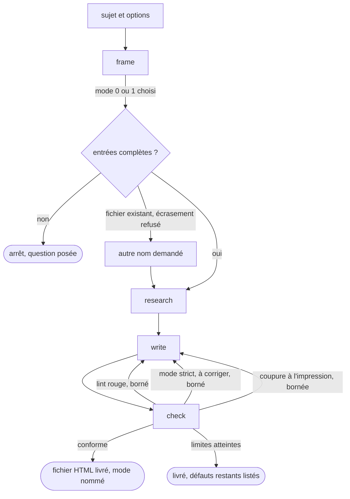

# dev-tech-comparison

Produit une note de décision technique qui se lit à froid, en un fichier HTML que l'on ouvre, imprime ou convertit en PDF. Le skill rend la main sur un fichier conforme ou sur la liste des défauts qu'il n'a pas pu lever dans les limites du mode choisi.

## Actions

Dérouler le flux. Ne lire que la prochaine action.

| Action | Fait |
| --- | --- |
| frame | remplir les entrées et fixer le dossier de sortie |
| research | sourcer et dater chaque chiffre, choisir le fil conducteur |
| write | copier le gabarit HTML et le remplir selon le contrat |
| check | lancer le lint, se relire, et en mode strict faire relire par un sous-agent neuf |

## Transversal rules

- **Un seul fil conducteur.** Un objet concret du domaine, suivi de bout en bout, et chaque section le fait avancer d'une étape. *Pourquoi : c'est ce qui rend le document lisible à froid, sans la conversation qui l'a produit.*
- **Le calcul se fait en code.** Pour chaque étape, le document dit qui la fait (modèle, LLM, code) et pourquoi. Un calcul, une conversion d'unités ou une vérification arithmétique se font toujours en code.
- **Le document ne parle qu'au lecteur.** Aucune mention de la conversation, du skill ni de l'agent dans le fichier livré.
- **Le texte livré suit `references/controles-redaction.md`**, y compris quand ces règles contredisent le style du chat. Elles sont plus strictes et visent un autre lecteur.

## References

- `references/contrat-document.md` — la structure en 12 blocs, les 5 illustrations minimales, le design et les règles d'impression
- `references/controles-redaction.md` — les règles de rédaction, les étapes du contrôle et le format du rapport du relecteur

## Assets

- `assets/gabarit-document.html` — le squelette du fichier livré, palette, mode sombre et impression A4 compris

## Test

Relecture sur un run réel, plus deux commandes jouables seules.

| Cas | Preuve |
| --- | --- |
| `python3 wrappers/claude/scripts/lint-skills.py --skill dev-tech-comparison` | rend 0, « 1/1 skills conformes » |
| `python3 wrappers/claude/scripts/tests/test-lint-html-prose.py` | rend 0, tous les cas passent |
| les cas d'[`evals/eval.json`](evals/eval.json), joués outils coupés | aucun n'ouvre `dev-tech-comparison` |
| le lint de prose sur le fichier livré d'un run réel | rend 0, ou le compte rendu liste les interdits restants |
