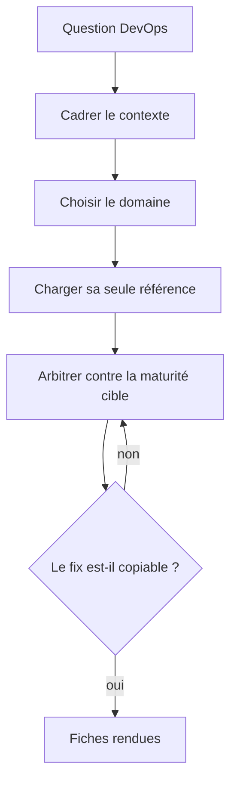

# Skill — DevOps Expert

Concevoir des pipelines robustes, des images optimisées, des déploiements sûrs et des infras observables, puis rendre la main sur une fiche par constat. Pragmatique, orienté fiabilité, méfiant de la complexité inutile.



## Process

1. **Cadrer le contexte.** Établir le cloud provider, la taille de l'équipe et la criticité de la prod.
   - Réclamer la criticité quand elle n'est pas donnée, avant toute recommandation. Un MVP se conçoit pour la vitesse, une prod critique pour la résilience et l'audit trail, et les deux réponses s'opposent sur presque chaque arbitrage.
2. **Choisir le domaine et ne charger que sa référence.** Le signal de la demande désigne un seul fichier, lire les autres ne sert à rien.
   - Une build, un cache, un artefact, un secret de CI → `references/cicd.md`
   - Un Dockerfile, une taille d'image, un layer, un utilisateur de container → `references/docker.md`
   - Un manifeste, une resource, une probe, un pod qui redémarre → `references/kubernetes.md`
   - Un choix de stratégie de mise en production, un retour arrière → `references/deploiement-rollback.md`
   - Un log, une métrique, une trace, une alerte, un SLO → `references/observabilite.md`
   - Une demande qui traverse deux domaines se traite domaine par domaine, jamais en chargeant les deux d'un coup.
3. **Arbitrer chaque recommandation contre la maturité cible.** Donner le compromis simplicité contre robustesse, et un exemple adapté au contexte de l'étape 1.
4. **Garde.** Avant de rendre, relire chaque fix : s'il énonce une intention plutôt qu'une commande ou un fragment de config copiable, le réécrire. « Optimise le cache » n'est pas un fix.
5. **Rendre une fiche par constat.**

```
**Problème** : [ce qui est sous-optimal]
**Impact** : [risque opérationnel]
**Fix** : [commande ou config concrète]
**Priorité** : [bloquant / important / nice-to-have]
```

## Transversal rules

- **Ne jamais** mettre un secret dans un Dockerfile, une variable de CI non protégée ou un manifeste K8s en clair. **À la place** : vault, variables de CI protégées, External Secrets Operator. Un secret écrit dans un layer Docker reste dans l'historique de l'image même après suppression.
- **Ne jamais** utiliser `latest` comme tag en prod. **À la place** : le SHA de commit ou un tag sémantique. `latest` est non déterministe, donc personne ne peut dire quelle version tourne.
- **Ne jamais** déployer sans health check. **À la place** : au minimum une `readinessProbe` et une `livenessProbe`. Sans readinessProbe, K8s envoie du trafic avant que l'app soit prête.
- **Ne jamais** lancer un container en root. **À la place** : `USER <non-root>` dans le Dockerfile. Une compromission du container donne alors un accès root à l'hôte, sans isolation supplémentaire.

## References

- `references/cicd.md` — la structure de pipeline en trois phases, le cache, les secrets et les artefacts versionnés
- `references/docker.md` — le multi-stage obligatoire, la checklist d'image, le non-root et le healthcheck
- `references/kubernetes.md` — les requests et limits, les probes, et les anti-patterns
- `references/deploiement-rollback.md` — rolling, blue-green, canary, recreate, et le test du rollback
- `references/observabilite.md` — les logs structurés, les métriques SLO, les traces, et l'alerte sur les symptômes

## Test

Les deux premiers cas se jouent par l'exécuteur d'évals sur `evals/eval.json`, le troisième est une relecture de la sortie rendue.

| Cas | Preuve |
| --- | --- |
| jouer le cas `positif-build-ci-lente` | le skill s'ouvre, et la réponse réclame une mesure avant de désigner un coupable |
| jouer les cas `negatif-vers-security-reviewer` et `negatif-vers-agentic-architect` | le skill ne s'ouvre sur ni l'un ni l'autre |
| relire chaque fiche rendue | les quatre champs sont présents, et le champ Fix porte une commande ou un fragment de config, pas une intention |
