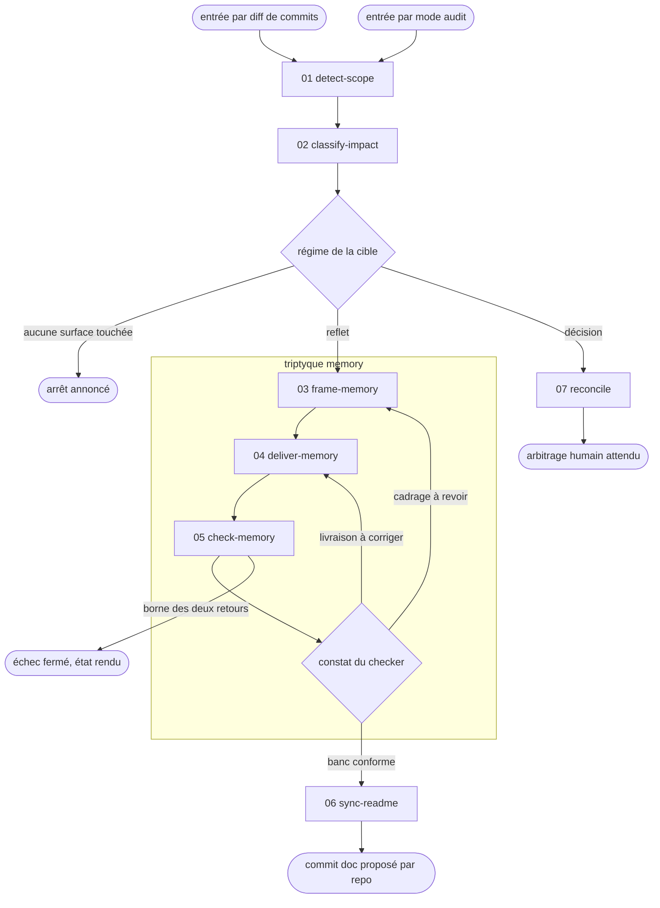

# doc-sync — synchroniser la doc avec le code validé

Ce skill remet la memory AIDD (`aidd_docs/memory/*`, relue par `/plan` et le brainstorming) et les README au niveau de l'état commité du code, et il rend la main dès qu'un arbitrage humain devient nécessaire. Sans cette remise à jour, le planning repart d'une base fausse. Le périmètre s'arrête là : pas de doc inline (Javadoc, JSDoc, docstring), pas de hook. La doc inline est un reflet elle aussi, mais elle se rafraîchit à chaud dans le flux de dev, contexte code déjà chargé, via l'agent `doc-writer`. La refaire à froid ici imposerait un re-scan par symbole coûteux et bruité.

## Actions

Dérouler le flux. Ne lire que la prochaine action.

| Action | Fait |
| --- | --- |
| detect-scope | détecte la topologie, puis propose et fait confirmer le scope |
| classify-impact | classe chaque fichier du scope en régime et en cible doc |
| frame-memory | décide ce qui mérite d'exister dans le banc, sans rien écrire |
| deliver-memory | écrit le plan cadré, par délégation à `/10-learn` ou en édition directe |
| check-memory | fait juger le banc par un checker indépendant et route ses constats |
| sync-readme | met à jour les README de régime reflet par repo, puis propose le commit doc |
| reconcile | compare doc-vs-code à HEAD et signale les écarts des surfaces de décision |

## Transversal rules

- **Deux entrées, un seul flux.** Par défaut le scope vient d'un diff de commits, la doc ayant pris du retard sur le code. En `--audit`, le scope est le banc de mémoire lui-même et il n'y a pas d'ancre git. Les deux entrées traversent ensuite les mêmes actions, et c'est le point : l'audit ne duplique aucun mécanisme, il élargit le scope de l'action `01`. *Pourquoi un mode et non une action à part : la détection de topologie et la confirmation du contrat servent à l'identique, et l'action `01` interdit nommément de réimplémenter la détection ailleurs.*
- **L'entrée se choisit avant toute autre chose.** `--audit` sur la ligne d'invocation la tranche. Sans flag, elle se déduit de la demande : « la doc a pris du retard sur ce qu'on vient de livrer » est une entrée par diff, « relis la mémoire, elle a dérivé » est un audit. Si les deux lectures tiennent, demander au lieu de choisir. *Pourquoi ne pas deviner : prendre l'entrée par diff sur une intention d'audit fait rendre « aucune surface doc touchée » à l'action `02`, et le skill s'arrête en annonçant que tout va bien. L'erreur est silencieuse et ressemble à un succès.*
- **Le triptyque memory reprend les mots de `aidd-orchestrator:01-sdlc`.** Frame décide ce qui mérite d'exister, deliver écrit, check fait juger par un agent qui n'a pas écrit. *Pourquoi trois étapes et non une : sans cadrage, la mémoire grossit à chaque passe puisque rien ne dit ce qui n'a pas à y entrer. Sans contrôle indépendant, celui qui a écrit juge son intention au lieu de son résultat.* L'action `05` route ses constats vers l'étape qui les répare, elle ne corrige rien elle-même.
- **En coordinateur, le flux vaut par repo.** Chaque enfant est traité comme un mono-repo, c'est le Boulot 1. Le contrat partagé au parent est traité en régime décision, c'est le Boulot 2 et il passe par l'action `07`. Le home memory de chaque enfant se résout à l'action `01`. Si l'action `02` ne trouve aucune surface impactée, s'arrêter là, sauf en `--audit` où le scope **est** la surface et où cet arrêt n'existe pas.
- **La doc ne couvre que le validé.** Elle reflète l'état commité ou mergé, jamais du code en vol : documenter du WIP risque de décrire ce qui changera encore ou sera abandonné. Le défaut est donc « commité only », toujours. Le scope porte sur des ranges de commits et non sur le working tree, ce qui exclut sans effort le WIP sale d'une autre tâche. Le WIP non commité reste un opt-in explicite et averti, réservé au cas rare où le code est figé mais pas encore commité.
- **Édition directe : lire la structure d'abord.** Dès que le skill édite une surface doc sans skill délégué qui en gouverne le style (fallback memory en action `04`, README en action `06`), lire d'abord la structure et les conventions existantes du fichier (sections, format des tables, ton, niveaux de titre) et s'y conformer. *Pourquoi : un skill délégué comme `10-learn` porte ses propres conventions, alors qu'en édition directe rien ne gouverne le style. Sans inspection préalable, l'édition introduit une incohérence de forme qui dégrade la doc.*
- **Une entrée qui recopie un fichier du disque n'entre pas** dans la mémoire : ni arbre de fichiers, ni schéma, ni liste de scripts, ni extrait de config. Un pointeur de chemin la remplace. Le critère complet vit dans `references/memory-criteria.md`, et cette règle est le seul volet qui doit être connu **avant** de charger quoi que ce soit. *Pourquoi : la copie et sa source ne divergent pas au même rythme, donc la copie devient un piège au lieu d'un raccourci.*

## References

- `references/regimes-de-doc.md` — les deux régimes d'autorité, leur cas limite, et la topologie des homes de doc
- `references/memory-criteria.md` — le critère d'inclusion d'une entrée de mémoire, et ses trois calibrages

## Test

Relecture humaine du run déroulé : aucune de ces lignes n'est jouable seule.

| Cas | Preuve |
| --- | --- |
| une demande sans flag dont les deux lectures tiennent | le skill demande l'entrée au lieu de la choisir |
| un fichier de régime décision dans le scope | il ressort en écart signalé, aucun edit ne le touche |
| trois contrôles consommés sans banc conforme | le skill rend l'état intermédiaire, il ne déclare rien à jour |
| un run en coordinateur centralisé | deux commits proposés, la memory au parent et le README chez l'enfant |
