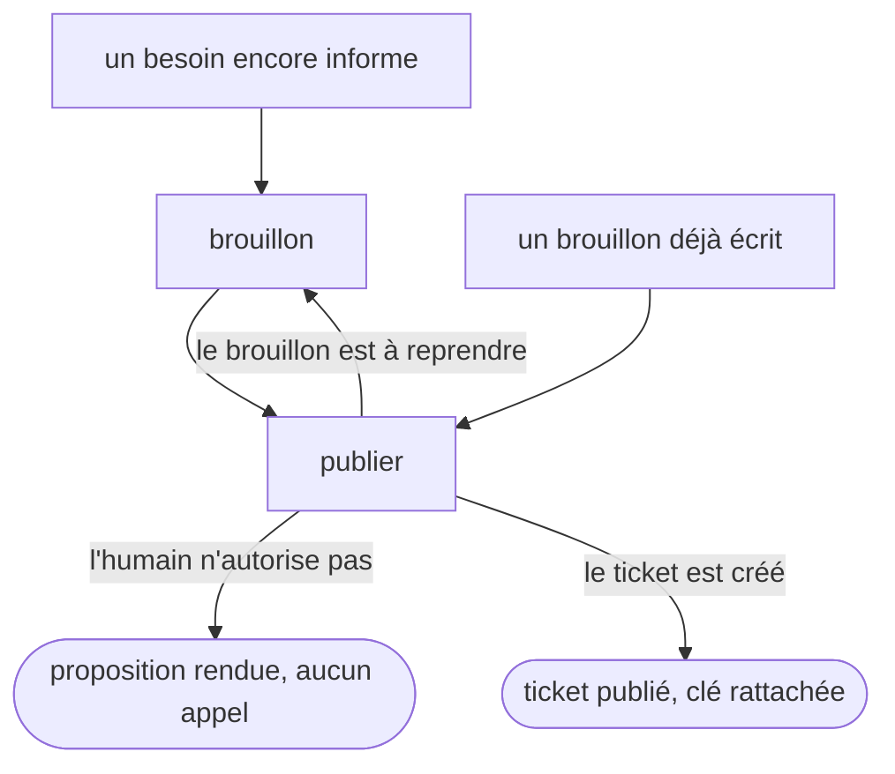

# jira

Fait le pont entre un artefact de backlog du dépôt et son ticket Jira. Le framework AIDD écrit le
brouillon, ce skill lui donne une clé de ticket et l'y envoie.

## Actions

Dérouler le flux. Ne lire que la prochaine action.

| Action | Fait |
| --- | --- |
| brouillon | choisir le type, déléguer la rédaction au skill `aidd-pm`, contrôler l'artefact contre les conventions du dépôt |
| publier | mettre en forme, demander, créer le ticket, rattacher la clé, geler le brouillon |

## Transversal rules

- **Ce skill ne rédige rien.** Le brouillon appartient au skill `aidd-pm` de son type, qui porte son
  cycle de vie, ses relations et ses critères de maturité. *Pourquoi : réécrire cette logique ici la
  dédoublerait, et perdrait une trentaine de fichiers de connaissance qu'aucun skill maison ne
  reproduit.*
- **La mémoire du dépôt fait autorité sur tout ce qui est propre au projet.** Le site Jira, les clés
  de projet autorisées, la convention de scope, le banc d'essai, le chemin des gabarits de
  description : lus dans la mémoire, jamais codés ici. Les gabarits d'`assets/` sont le défaut neutre
  qui s'applique quand le dépôt n'en déclare aucun. *Pourquoi : ce skill est partagé publiquement,
  donc aucune donnée d'un client n'y entre. Et c'est le mécanisme prévu par le framework, dont
  `01-ticket-info/references/tool-detection.md` place l'outil de ticketing dans la mémoire projet.*
- **Rien ne part vers Jira sans une demande explicite à l'humain**, nommant le ticket visé et ce que
  l'appel va écrire. Vaut pour une création, un commentaire, un lien **et une édition**. Attendre sa
  réponse, ne jamais la déduire d'un accord donné plus tôt sur autre chose. *Pourquoi : un ticket créé
  ne se supprime pas forcément, le droit de suppression n'étant ni acquis pour l'humain ni exposé par
  le connecteur MCP. Une écriture est donc définitive.*
  **Demander reste une consigne tant qu'un garde ne l'adosse pas.** Un harnais permissif saute les
  invites ordinaires, donc cette règle ne tient rien toute seule. Quand le harnais sait rendre une
  invite qui survit à ce mode, l'adosser à ce mécanisme plutôt que compter sur ma discipline : ça
  transforme la même demande en porte. *Mesuré sur Claude Code 2.1.250 : une règle `permissions.ask`
  prompte même en `bypassPermissions`, et un hook rendant `"allow"` ne l'écrase pas.*
- **Un garde déterministe peut tenir la porte, et il a le dernier mot.** Si le dépôt en déclare un, son
  refus n'est pas un obstacle à contourner mais la réponse : demander à l'humain ce que le message du
  garde réclame. *Pourquoi : réessayer un appel refusé transforme un garde en ralentisseur.*
- **Jira fait foi après publication, le dépôt garde le raisonnement.** Le brouillon devient un
  instantané de ce qui a été soumis, jamais le miroir du ticket vivant. *Pourquoi : l'équipe corrige
  les tickets publiés, donc une copie dans le dépôt divergerait en silence.*
- **Éditer un ticket existant demande deux conditions, jamais une.** La confirmation ci-dessus, et
  **l'humain doit être le rapporteur du ticket** — lu par un appel sur le champ `reporter` *avant*
  l'édition, jamais supposé. Rapporteur différent, on s'arrête et on rend le texte à coller.
  *Pourquoi la vérification et pas la confiance : un garde déterministe n'a ni réseau ni credentials,
  il ne peut pas lire ce champ. La borne n'existe que si ce skill la mesure.*
- **Transitionner un ticket ou y pointer du temps reste à l'humain**, même confirmé. *Pourquoi : qui
  déplace un ticket en répond, et l'historique dit qui a décidé, pas quel outil a tapé.*

## References

- `references/extension-frontmatter.md` — pourquoi le dépôt déclare un champ qui porte la clé du
  ticket, et pourquoi ce champ gèle le brouillon
- `references/rendu-jira.md` — ce que devient le markdown envoyé au connecteur, mesuré par
  aller-retour sur un ticket d'essai
- `references/redaction-chiffres.md` — pourquoi l'intention prime sur le compte dans un ticket,
  et à quelles conditions une liste chiffrée y a sa place

## Assets

- `assets/description-defaut.md` — la description d'un ticket dont le type n'a pas de gabarit propre
- `assets/description-task.md` — la description d'une task
- `assets/description-user-story.md` — la description d'une user story

## Test

Le mécanique se joue seul par le lint. Le non-déclenchement se joue par l'exécuteur d'évals externe,
jamais depuis la session qui vient d'écrire le skill.

| Cas | Preuve |
| --- | --- |
| `python3 wrappers/claude/scripts/lint-skills.py --skill jira` | rend 0, « 1/1 skills conformes » |
| les deux cas négatifs d'`evals/eval.json`, joués outils coupés | le skill ne s'ouvre pas, le registre de la session ne le nomme pas |
