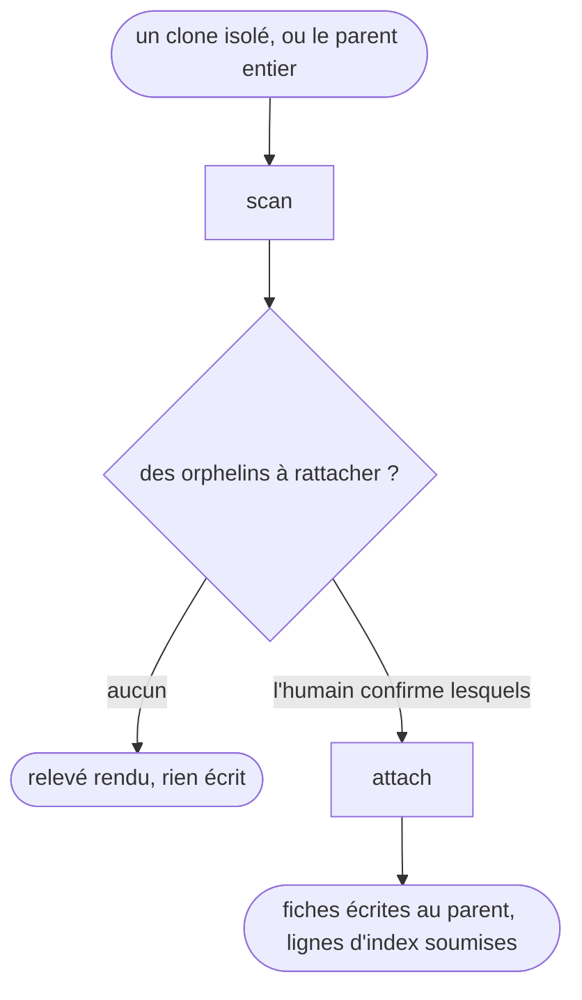

# memory-bootstrap

Amorce la memory AIDD d'un **orchestrateur parent**, un repo sans code applicatif propre qui héberge la memory de N repos enfants autonomes. Il produit deux choses par enfant rattaché : un `aidd_docs/memory/<enfant>/tooling.md` qui décrit son outillage réel, et une ligne dans l'index racine qui dit quelles commandes font **porte**.

## Actions

Dérouler le flux. Ne lire que la prochaine action.

| Action | Fait |
| --- | --- |
| scan | détecte les enfants, les orphelins, les entrées périmées, et la preuve d'outillage de chacun |
| attach | écrit la fiche d'outillage de chaque enfant confirmé, puis soumet sa ligne d'index |

## Transversal rules

- **L'index racine est ce qui rend les fiches atteignables.** Le hook `update_memory.js` ne scanne que la **racine** de `aidd_docs/memory/`, plus `internal/` et `external/`. Un `<enfant>/tooling.md` n'apparaît donc jamais dans le bloc `<aidd_project_memory>` : le fichier existe, et rien ne dit qu'il existe. L'index, lui, est chargé en `@`-référence et nomme les chemins enfants. Il sert aussi de contrat à `aidd-dev:03-assert`, qui lit `aidd_docs/memory/coding-assertions.md` par chemin codé en dur (`03-assert/actions/01-assert.md`).
- **Ne jamais écrire dans un repo enfant.** Toute sortie atterrit sous `aidd_docs/memory/` du parent. *Pourquoi : les enfants sont des repos d'équipe, et y déposer un `aidd_docs/` est un problème de gouvernance et non une commodité technique.*
- **L'index pointe vers les enfants, jamais l'inverse.** Un `tooling.md` ne référence pas l'index. *Pourquoi : une back-référence est un doublon à maintenir, donc un doublon qui divergera.*
- **Ne rien committer.** Le skill laisse le working tree au parent. *Pourquoi : le rattachement se relit avant d'entrer dans l'historique.*
- **Un seul chemin, pas de mode « un enfant » distinct d'un mode « tous les enfants ».** Le scan trouve ce qui manque, l'humain confirme ce qui mérite d'être rattaché, l'attache boucle dessus. *Pourquoi : deux modes séparés dupliqueraient la même logique, donc le même bug à deux endroits.* Le scan seul est utile, il audite le parent sans rien écrire.
- **Deux règles gouvernent l'écriture et vivent là où elle a lieu**, dans `actions/02-attach.md` : le partage d'autorité entre ce qui s'écrit seul et ce qui se propose (étapes 3 et 4), et la provenance des gabarits (étape 1).

## Test

Relecture humaine du run déroulé : les vérifications par action vivent dans leurs fichiers, celles-ci portent sur le flux entier.

| Cas | Preuve |
| --- | --- |
| un clone isolé, puis un amorçage complet | les deux runs passent par les mêmes deux actions, aucune branche propre à l'un des deux |
| le scan rend des orphelins et personne ne répond | rien n'est écrit, l'attache n'est pas lancée |
| un run complet accepté | tous les fichiers touchés sont sous `aidd_docs/memory/` du parent |
| un run complet accepté | `git log -1 --format=%H` rend le même hash avant et après, au parent comme chez chaque enfant |
