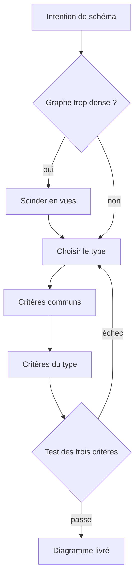

# Skill — Mermaid Craft

Produire des diagrammes Mermaid lisibles d'un coup d'œil, y compris sur un écran en portrait, et rendre la main une fois le bloc écrit ou le verdict de relecture posé.

## Process

1. **Garde.** Si tenir « vertical » et « zéro croisement » rendrait le diagramme illisible, le diagramme fait trop.
   - Le scinder en plusieurs vues, plutôt que sacrifier la lisibilité.
2. **Choisir le type.** Prendre celui qui porte la nature du propos, jamais celui qu'on a sous la main.
   - **flowchart** pour un flux logique ou une architecture
   - **sequence** pour des échanges ordonnés entre acteurs
   - **ER** pour un modèle de données
   - **class** pour une structure de code
   - **state** pour un cycle de vie
   - **gantt** ou **journey** pour du temps ou de l'expérience vécue
3. **Appliquer les critères communs.** Ils valent quel que soit le type retenu.
   - **Labels courts et synthétiques** : nom ou nom+verbe, jamais une phrase. Un détail long part en note séparée, pas dans le nœud.
   - **Un concept par nœud** : un nœud qui décrit deux choses se scinde.
   - **La couleur porte du sens, jamais de la décoration** : colorer pour dire un rôle, un état, une couche ou une criticité. Rester sobre, quelques `classDef` réutilisées, contraste lisible en clair comme en sombre.
   - **Regrouper en sous-graphes** quand des nœuds partagent une couche, un domaine ou une phase. La structure visuelle doit refléter la structure logique.
   - **Un seul sens de lecture** : le flux principal descend, les retours et boucles sont l'exception visible.
4. **Appliquer les critères du type choisi.** Ils s'ajoutent aux communs, ils ne les remplacent pas.
   - **Flowchart** : `TD`, sous-graphes pour les phases et les couches, une décision est un losange à sorties étiquetées (`oui`/`non`) et non croisées. Éviter les nœuds à plus de trois sorties.
   - **Sequence** : ordonner les acteurs de gauche à droite selon leur premier appel, ce qui minimise les croisements de messages. Grouper les échanges liés en `alt`, `opt` ou `loop`, et marquer la durée de vie avec `activate`.
   - **ER** : cardinalités explicites sur chaque relation. N'afficher que les attributs porteurs de sens pour le propos, pas tout le modèle physique.
   - **Class** : visibilité et types utiles seulement. Héritage à la verticale, associations à l'horizontale, aucun attribut cosmétique.
   - **State** : un seul état initial `[*]`, transitions nommées par l'événement déclencheur, états composites pour regrouper.
   - **Gantt et Journey** : réservés aux dimensions temps et expérience, sections pour regrouper. Ne pas les détourner pour un flux logique, qui relève du flowchart.
5. **Passer le Test.** Un échec renvoie à l'étape 2, il ne s'accepte pas.

## Transversal rules

- Les deux non-négociables, vertical par défaut et zéro croisement de flèches, vivent dans `rules/mermaid.md`, chargée en permanence donc déjà présente quand ce skill se lit. Ne pas les redire ici ni en écrire de variante, deux sources dérivant au premier edit de l'une des deux.
- Un diagramme qui échoue au Test se corrige par réordonnancement ou par scission, jamais en acceptant l'écart.

## Test

Relecture humaine du diagramme rendu, les trois cas passent ou échouent.

| Cas | Preuve |
| --- | --- |
| afficher le diagramme sur un écran en portrait | il tient dans la largeur, sans scroll horizontal |
| suivre chaque arête de son départ à son arrivée | aucune n'en croise une autre |
| retirer toutes les couleurs | aucune information n'est perdue, et chaque couleur employée venait d'une classe `classDef` nommée |
