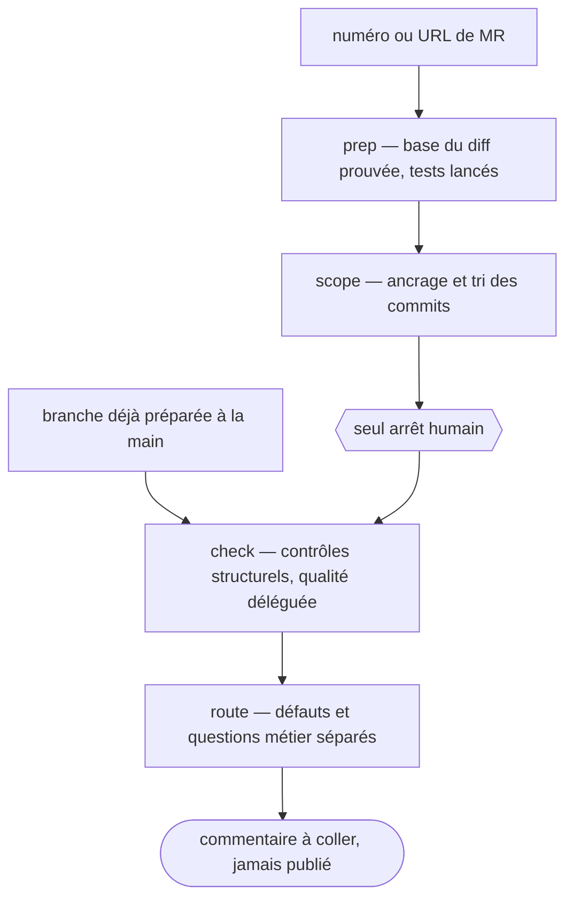

# mr-review

Reviewer une grosse MR sans maîtriser le domaine métier. Le skill fait le travail mécanique que
personne ne fait à la main sans se tromper, retrouver le vrai périmètre du diff. Il borne ensuite la
revue à ce qui est jugeable sans contexte, et route le reste.

## Actions

Dérouler le flux. Ne lire que la prochaine action.

| Action | Fait |
| --- | --- |
| prep | ramener la MR en branche locale, prouver la base du diff, lancer les tests |
| scope | poser la phrase d'ancrage, trier les commits, faire confirmer le périmètre |
| check | passer les contrôles qui ne demandent aucun contexte métier |
| route | séparer défauts et questions métier, rendre le commentaire à coller |

## Transversal rules

- **Lecture seule de bout en bout.** Aucune écriture sur la MR, aucun `push`, aucun commentaire
  publié. La sortie finale est un texte à coller. *Pourquoi : le token `glab` est en lecture seule,
  et la relecture avant publication est la bonne place de l'humain dans la boucle.*
- **Séquence stricte, avec une seule entrée dérogatoire.** Chaque étape consomme la sortie de la
  précédente. Entrer directement dans `check` reste possible sur une branche préparée à la main.
  Le périmètre du diff n'est alors pas prouvé, et il faut le dire avant de rendre les findings.
- **Un problème d'accès arrête le flux, il ne se contourne pas.** Token expiré ou révoqué, hôte
  injoignable, projet interdit, `iid` inexistant : le skill s'arrête, dit laquelle des quatre causes
  s'applique et la commande qui l'a révélée. Jamais de repli sur une dérivation locale.
  *Pourquoi : le repli produit une base plausible mais fausse, donc une revue confiante sur le
  mauvais diff, exactement la panne silencieuse que le contrôle de périmètre existe pour éviter.*
  - **Mais nommer la cause avant de s'arrêter**, et d'abord écarter celles qui ne sont pas des
    problèmes d'accès. Un `glab api` lancé hors du clone rend `404` avec un accès parfaitement
    intact (voir la référence). *Pourquoi : échouer fermé sur la mauvaise cause envoie corriger un
    accès qui marche, ce qui coûte autant qu'échouer ouvert et se voit moins.*
- **Le périmètre du diff se prouve, il ne se devine pas.** Une base fausse fait relire le mauvais
  diff sans que rien ne le signale. *Pourquoi : c'est une panne silencieuse, le reviewer rendant une
  revue confiante sur des lignes qui ne sont pas celles de la MR.*
- **La qualité de code est déléguée, jamais réécrite ici.** *Pourquoi : deux skills la couvrent
  déjà, et un troisième jeu de critères divergerait du leur au premier edit.*
- **Un seul arrêt humain, à l'étape `scope`.** Le reste s'enchaîne. *Pourquoi : empiler les
  questions ouvertes bloque au lieu de faire avancer. Une décision à la fois.*
- **Ne jamais trancher la valeur métier.** « Ce chiffre est-il le bon », « cette liste est-elle
  complète » se routent au propriétaire de la spec. *Pourquoi : les confondre avec de la revue de
  code coûte des heures et ne produit aucun retour livrable.*
- **Un retour partiel livré vaut mieux qu'une revue complète jamais rendue.** Si une étape bloque,
  rendre ce qui est acquis et dire ce qui manque. *Pourquoi : sur une MR de cette taille, la revue
  exhaustive n'arrive jamais, donc l'exiger revient à ne rien rendre.*

## References

- `references/glab-et-base-du-diff.md` — les commandes `glab` et `git`, et pourquoi les deux façons
  évidentes de trouver la base du diff donnent un faux résultat
- `references/controles-structurels.md` — les contrôles de `check`, un exemple concret chacun

## Assets

- `assets/commentaire-mr.md` — le gabarit du commentaire rendu par `route`

## Test

Le déclenchement se joue par [`evals/eval.json`](evals/eval.json). Le reste se constate sur la
sortie d'un run réel, jamais sur un mock.

| Cas | Preuve |
| --- | --- |
| `python3 wrappers/claude/scripts/lint-skills.py --skill mr-review` | rend 0, « 1/1 skills conformes » |
| les cas d'[`evals/eval.json`](evals/eval.json), joués outils coupés | le cas positif ouvre `mr-review`, aucun des trois frères cités en clause NE PAS ne l'ouvre |
| chercher `glab mr note`, `approve`, `merge` et `update` dans les commandes lancées pendant un run | zéro appel |
| comparer les blocs du commentaire rendu à ceux d'[`assets/commentaire-mr.md`](assets/commentaire-mr.md) | tous présents, dans l'ordre du gabarit |
