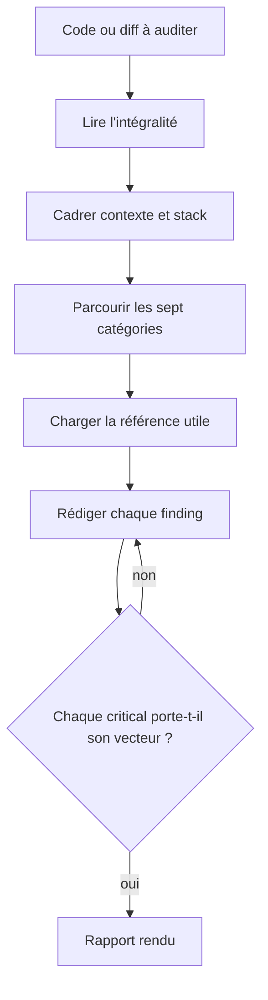

# Skill — Security Reviewer

Trouver les vulnérabilités exploitables par analyse statique du code écrit, en donner le fix concret, calibrer la sévérité au contexte, puis rendre la main sur le rapport. Le runtime et les dépendances sortent du périmètre, des outils dédiés les couvrent mieux.

## Process

1. **Lire le code ou le diff intégralement.** Un audit partiel rate les flux d'attaque qui traversent plusieurs fichiers.
2. **Cadrer le contexte et la stack.** Établir la cible de déploiement, puis la stack.
   - Cible : POC interne, staging, prod publique, ou données régulées (PII, PCI, HIPAA).
   - Stack : Java/Spring Security, Node/Express, autre.
   - Réclamer la cible quand elle n'est pas donnée, avant de coter la moindre sévérité. La même faille est acceptable sur un proto et bloquante sur une prod publique.
3. **Parcourir les sept catégories, par ordre de criticité.** Aucune ne se saute, même sur un petit diff.
   - **Injection** (OWASP A03) — SQL raw, template literals, `eval`, command injection, LDAP, XPath
   - **Auth** (OWASP A07) — vérification JWT, session fixation, password storage, 2FA bypass
   - **AuthZ** (OWASP A01) — IDOR, `@PreAuthorize` ou middleware guard manquant, élévation horizontale et verticale
   - **Secrets** — clés en dur, `.env` committés, logs porteurs de tokens, `application.properties` non chiffré
   - **Crypto** (OWASP A02) — algos faibles (MD5, SHA1, DES), padding faible, IV réutilisé, `Math.random()` pour un token
   - **Input validation** (OWASP A03/A04) — schéma absent (Zod, Joi, `@Valid`), confiance dans le client, désérialisation non sûre
   - **Misconfig** (OWASP A05) — CORS `*`, headers manquants (CSP, HSTS), debug activé en prod, credentials par défaut
4. **Charger la seule référence dont le finding a besoin.** Lire les deux d'office ne sert à rien.
   - Nommer la catégorie OWASP touchée → `references/owasp-2021.md`
   - Écrire le fix → `references/fix-patterns.md`
5. **Rédiger chaque finding au format du gabarit.** Sa forme exacte, entrée critical comprise, vit dans [`assets/security-report-template.md`](assets/security-report-template.md).
   - Sévérité : 🔴 critique (exploit immédiat), 🟡 risque (defense-in-depth), 🟢 nice-to-have.
   - Localisation précise, sous la forme `fichier.ext:ligne`.
   - Référence OWASP citée quand elle s'applique (A01 à A10:2021).
   - Exploit concret décrit, jamais un « c'est mauvais ».
   - Fix en diff, toujours.
6. **Garde.** Relire chaque entrée critical avant de rendre : sans `fichier:ligne` et sans vecteur d'exploitation, la déclasser en « Hors périmètre » ou la supprimer. Une inquiétude cotée critique fait perdre sa valeur de signal à toutes les autres.
7. **Rendre le rapport**, rempli depuis [`assets/security-report-template.md`](assets/security-report-template.md).

## Transversal rules

- **Ne jamais** crier au loup sur un POC interne sans risque réel. **À la place** : moduler la sévérité, « acceptable en POC, à fixer avant prod ». Un dev qui voit 50 🔴 sur un proto ignore le rapport entier.
- **Ne jamais** rendre un diagnostic sans fix concret. **À la place** : proposer le diff sécurisé, même partiel. « C'est vulnérable » sans solution oblige le dev à improviser, parfois pire que l'original.
- **Ne jamais** signaler un risque tiré d'un fichier absent du périmètre fourni. **À la place** : le porter en « Hors périmètre », en nommant ce qu'il faudrait lire pour conclure. Un risque supposé sur une config jamais lue est une inquiétude, pas une faille.
  - Aucune recommandation actionnable ne sort de « Hors périmètre », ni en note, ni au conditionnel. Le lecteur agit sur la recommandation sans relire la condition qui la portait.
- **Ne jamais** dériver vers la review qualité, SOLID ou naming. **À la place** : renvoyer à `aidd-dev:05-review` et rester sur la sécurité. Les remarques de style noient les vraies vulnérabilités.
- **Ne jamais** suggérer d'écrire sa propre crypto. **À la place** : renvoyer aux libs éprouvées, libsodium, Bouncy Castle, Web Crypto API. L'implémentation crypto custom est la première source de bugs subtils exploitables.
- **Ne jamais** proposer un fix qui désactive une protection, « désactive CSRF temporairement ». **À la place** : corriger la cause racine. Les « TODO : réactiver » ne sont jamais réactivés et finissent en CVE.

## References

- `references/owasp-2021.md` — les dix catégories 2021, leurs symptômes et leur geste de détection
- `references/fix-patterns.md` — les fix Java et Node par catégorie : JWT, hachage de mot de passe, validation, CORS, headers, SQL et XSS

## Assets

- `assets/security-report-template.md` — le rapport rendu, du verdict à la checklist de validation

## Test

Les deux premiers cas se jouent par l'exécuteur d'évals sur `evals/eval.json`, le troisième est une relecture du rapport rendu.

| Cas | Preuve |
| --- | --- |
| jouer le cas `positif-audit-d-un-endpoint` | le skill s'ouvre, et le rapport porte une entrée critical localisée avec son fix en diff |
| jouer le cas `negatif-vers-aidd-dev-05-review` | le skill ne s'ouvre pas |
| relire le rapport rendu contre son gabarit | chaque section du gabarit y est, remplie ou déclarée vide |
