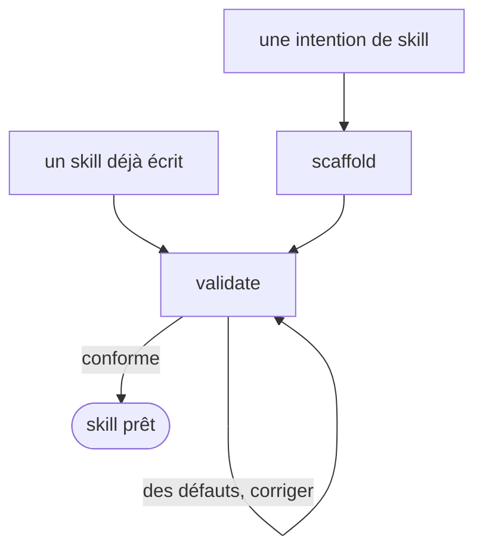

# skill-craft

Fabrique de skills perso. Il applique ma convention de rédaction au lieu de dépendre du plugin AIDD, et ne couvre que les skills de `skills/` — ni les règles, ni les agents, ni les hooks.

## Actions

Dérouler le flux. Ne lire que la prochaine action.

| Action | Fait |
| --- | --- |
| scaffold | échafauder un skill neuf depuis son intention |
| validate | lancer le lint sur un skill, puis relire ce qu'il ne voit pas |

## Transversal rules

- **La convention est l'unique source.** Les règles, l'anatomie et le nommage vivent dans [`references/skill-authoring-fr.md`](references/skill-authoring-fr.md) et les deux gabarits d'`assets/`. Les actions les citent, ne les recopient pas.
- **Le lint fait le mécanique, la relecture fait le reste.** `wrappers/claude/scripts/lint-skills.py` tranche les six vérifications sans interprétation. Ce qui demande de comprendre ce que le skill *fait* n'entre jamais dans un script, et reste à l'étape de relecture de `validate`.
- **Les évals ne se jouent pas d'ici.** `validate` rend la commande de l'exécuteur externe et déclare la passe non jouée. *Le contexte qui vient d'écrire un skill se noterait lui-même, et il se donne toujours la moyenne.*
- **Sans dépendance AIDD.** Ce skill ne compose aucun skill du plugin et ne suppose rien d'installé. Il porte sa propre convention, pour qu'un skill perso se crée n'importe où et sans repasser par une traduction depuis l'anglais.

## References

- `references/skill-authoring-fr.md` — les règles, les cinq deltas par rapport à AIDD, et les deux dérives que le lint ne voit pas

## Assets

- `assets/skill-template.md` — le moule d'un `SKILL.md`, et la source de sa liste de sections
- `assets/action-template.md` — le moule d'un fichier d'action

## Test

Jouable seul, sans session neuve : les deux commandes tranchent sans LLM.

| Cas | Preuve |
| --- | --- |
| `python3 wrappers/claude/scripts/lint-skills.py --skill skill-craft` | rend 0, « 1/1 skills conformes » |
| `python3 wrappers/claude/scripts/tests/test-lint-skills.py` | rend 0, tous les cas passent |
