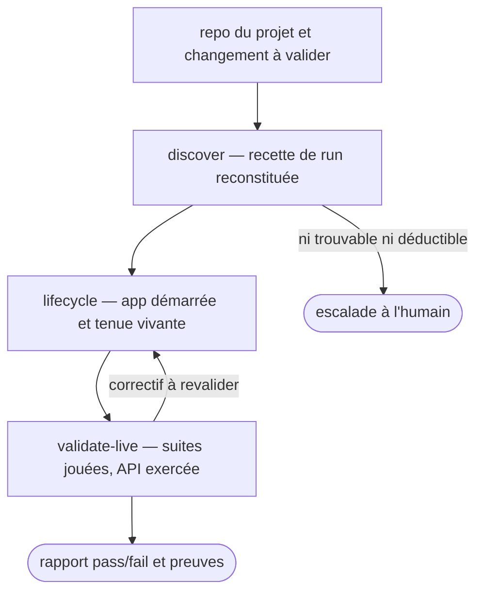

# test-runner

Testeur **générique**, il ne connaît aucun projet à l'avance. Il découvre comment démarrer et tester
l'app, puis rend un résultat exploitable par son caller.
Il possède quatre choses, et rien d'autre.
Le **cycle de vie** de l'app : démarrer, sonder, arrêter.
La **découverte de la recette de run** : commande de démarrage, secrets et env, URL de
disponibilité, commande de test.
La **validation live** : les suites de tests existantes, puis l'API réelle exercée en curl.
Le **garde-coût** : il reconnaît les opérations payantes et exige une confirmation avant de les
lancer.
Agnostique : les *sources* où il puise sont conventionnelles, seules les *valeurs* changent d'un
projet à l'autre.

## Actions

Dérouler le flux. Ne lire que la prochaine action.

| Action | Fait |
| --- | --- |
| discover | reconstituer la recette de run, sans rien démarrer |
| lifecycle | démarrer, sonder puis arrêter l'app, de façon idempotente |
| validate-live | jouer les suites et exercer l'API, rendre pass/fail et preuves |

## Transversal rules

- **Découvrir, déduire, jamais inventer.** Une valeur qui existe et dont le sens colle par preuve
  s'utilise, même si son nom ne matche pas au mot près. Ce qui n'est ni trouvable ni déductible
  s'escalade, et ne se remplit jamais au jugé. L'échelle à trois barreaux et son exemple vivent dans
  [`references/discovery.md`](references/discovery.md). *Pourquoi la déduction est autorisée : sans
  elle le testeur bloque sur tout projet dont le nommage n'est pas celui qu'il attendait, ce qui est
  le cas général.*
- **Aucune valeur d'un projet ne se met en dur ici.** La recette se recalcule à chaque run.
  *Pourquoi : c'est ce qui tient l'agnosticisme, une valeur figée survivrait au projet qui l'a
  introduite et ferait échouer le suivant.*
- **Le verdict reste honnête.** Ce qui n'a pas pu être exercé se déclare non couvert, jamais « tout
  vert » par défaut. *Pourquoi : un caller qui reçoit un vert faux arrête d'investiguer, ce qu'un
  rouge ne provoque pas.*
- **Toute question à l'humain se pose côté parent**, qu'il s'agisse d'une escalade de découverte ou
  d'une confirmation d'opération payante. *Pourquoi : un subagent n'a aucun canal pour la poser, sa
  question part dans son rapport de fin et arrive trop tard.*
- **Ce skill exécute, il ne juge pas la feature.** Il rend des faits, le caller conclut.
- **Son effet de bord est gardé par un hook, et pas par son mode d'invocation.**
  `wrappers/claude/scripts/hooks/guard-no-remote-write.py`, câblé en `PreToolUse` dans
  `wrappers/claude/settings.json`, refuse toute écriture vers preprod et prod, `curl` compris dès
  qu'il porte un corps ou un verbe autre que `GET`. Le local reste ouvert, ce dont un testeur a
  besoin. *Pourquoi ce mécanisme et non `disable-model-invocation` : le champ supprimerait la voie
  d'appel que la description promet à un orchestrateur. C'est la branche « maillon de pipeline » de la
  R13 de `skill-craft`, qui porte la mesure.*

## References

- `references/discovery.md` — l'ordre des sources de découverte, et l'échelle découvrir, déduire,
  escalader

## Test

Le lint se joue seul. Le reste se constate sur la sortie d'un run réel, jamais sur un mock.

| Cas | Preuve |
| --- | --- |
| `python3 wrappers/claude/scripts/lint-skills.py --skill test-runner` | rend 0, « 1/1 skills conformes » |
| lancer le skill sur un repo dont aucune source ne porte un champ de la recette | le champ sort en `non couvert` dans `gaps`, aucune valeur inventée |
| relever les process encore vivants après la fin d'un scope subagent | zéro orphelin, chaque démarrage a son arrêt |
| lancer le skill sur un repo qui porte une opération payante | aucun appel payant avant une confirmation humaine explicite |
| relire le verdict rendu quand une couche n'a pas pu être exercée | `notCovered` la nomme, le verdict n'est pas « tout vert » |
