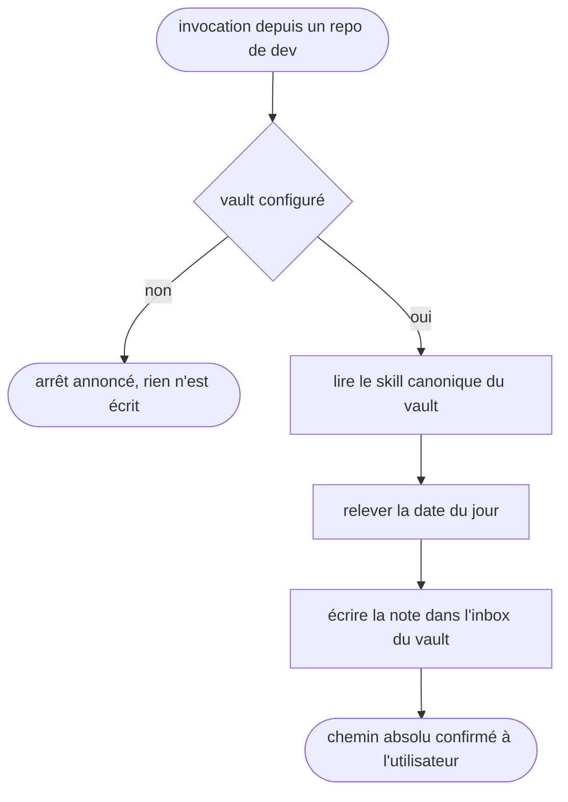

# vault-capture — capturer une note dans le vault depuis un repo

Passerelle vers le vault Obsidian : le CWD est un repo de dev et jamais le vault, et le skill rend la main dès que la note est écrite et son chemin confirmé.

## Process

1. **Garde.** Vérifier que le vault existe avant toute autre chose.
   - `bash -lc '[ -n "$OBSIDIAN_VAULT_PRO" ] && [ -d "$OBSIDIAN_VAULT_PRO" ] && echo OK'`
   - Sortie autre que `OK` → dire « Vault non configuré (`$OBSIDIAN_VAULT_PRO` absent). J'arrête. » et s'arrêter là.
   - *Pourquoi une garde et pas une hypothèse : cette config tourne aussi sur des postes sans vault.*
2. **Délégation.** Lire et suivre les instructions du skill canonique, `$OBSIDIAN_VAULT_PRO/.agents/skills/capture/SKILL.md`.
3. **Date.** Relever la date du jour pour le nom de fichier au format `YYYY-MM-DD` : `bash -lc 'date +%F'`.
4. **Écriture.** Créer le fichier de note dans `$OBSIDIAN_VAULT_PRO/0_INBOX/`.
5. **Confirmation.** Rendre à l'utilisateur le chemin absolu du fichier créé.

## Transversal rules

- **Tout chemin se résout contre `$OBSIDIAN_VAULT_PRO`.** Le CWD étant un repo de dev, un chemin relatif écrirait la note dans le repo et non dans le vault.
- **Jamais d'écriture de repli dans le repo courant.** Une note posée là est une capture perdue : elle n'entre pas dans le vault et pollue un diff de code.
- **Aucune dégradation silencieuse.** Inbox introuvable, écriture refusée, skill canonique muet : l'anomalie se dit à l'utilisateur au lieu d'être avalée dans la confirmation.

## Test

Jouable seul, sauf la dernière ligne qui se relit à la main.

| Cas | Preuve |
| --- | --- |
| `bash "$SKILLS_ROOT/_shared/check-vault-bridge.sh" vault-capture`, vault en place | `exit 0` : les cibles canoniques citées au `## Process` résolvent réellement |
| la même commande, cible canonique renommée ou déplacée | `exit 1` |
| la même commande, vault absent ou `SKILL.md` illisible | `exit 2`, jamais un succès silencieux |
| invocation du skill avec `$OBSIDIAN_VAULT_PRO` vidé | l'arrêt annoncé par la garde, pas une écriture dans le repo courant |
