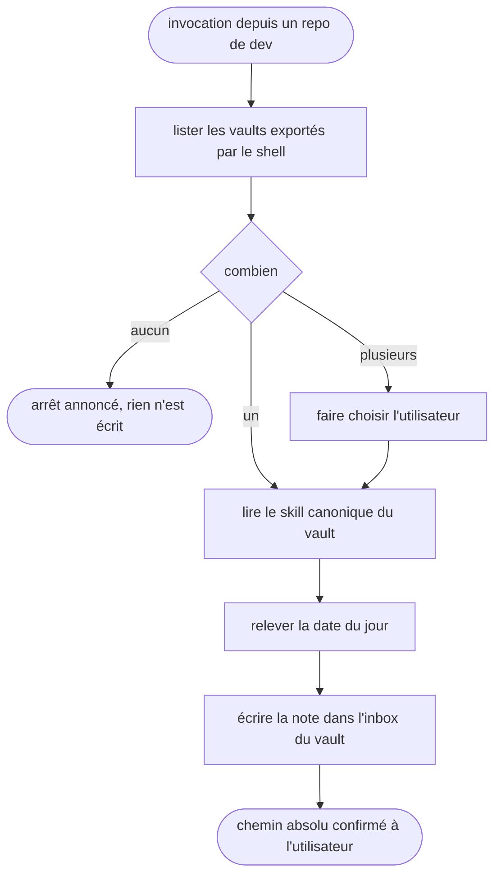

# vault-capture — capturer une note dans le vault depuis un repo

Passerelle vers le vault Obsidian : le CWD est un repo de dev et jamais le vault, et le skill rend la main dès que la note est écrite et son chemin confirmé.

```mermaid
flowchart TD
  entree([invocation depuis un repo de dev]) --> liste[lister les vaults exportés par le shell]
  liste --> n{combien}
  n -->|aucun| arret([arrêt annoncé, rien n'est écrit])
  n -->|un| canonique[lire le skill canonique du vault]
  n -->|plusieurs| choix[faire choisir l'utilisateur]
  choix --> canonique
  canonique --> date[relever la date du jour]
  date --> ecriture[écrire la note dans l'inbox du vault]
  ecriture --> confirme([chemin absolu confirmé à l'utilisateur])
```

## Process

1. **Garde et choix du vault.** Lister les vaults avant toute autre chose, sans supposer lequel existe.
   - `bash -lc 'bash "$SKILLS_ROOT/_shared/resolve-vault.sh"'`
   - `exit 0` → la sortie est le chemin du vault, noté `<vault>` plus bas.
   - `exit 3` → plusieurs vaults. Les proposer à l'utilisateur sous forme numérotée (une ligne `1 PERSO`, `2 PRO`, sans le chemin), lui demander de répondre par le numéro, puis relancer `resolve-vault.sh <numéro>` pour obtenir `<vault>`.
   - `exit 1` → dire « Aucun vault Obsidian configuré (aucune variable `OBSIDIAN_VAULT_*` dans le shell). J'arrête. » et s'arrêter là.
   - *Pourquoi une liste et pas un vault câblé : le même repo tourne sur un poste pro, un poste perso, ou les deux, et chaque poste n'a pas les mêmes vaults.*
2. **Délégation.** Lire et suivre les instructions du skill canonique, `<vault>/.agents/skills/capture/SKILL.md`. Ses chemins sont relatifs à la racine du vault et ses scripts se lancent depuis cette racine : `bash -lc 'cd "<vault>" && bash scripts/<script>.sh'`.
3. **Date.** Relever la date du jour pour le nom de fichier au format `YYYY-MM-DD` : `bash -lc 'date +%F'`.
4. **Écriture.** Créer le fichier de note dans l'inbox que désigne le skill canonique, sous `<vault>`. Ne pas écrire `0_INBOX` de mémoire : le nom du dossier varie d'un vault à l'autre (`0 INBOX/` dans le vault perso).
5. **Confirmation.** Rendre à l'utilisateur le chemin absolu du fichier créé.

## Transversal rules

- **Tout chemin se résout contre `<vault>`.** Le CWD étant un repo de dev, un chemin relatif écrirait la note dans le repo et non dans le vault.
- **Jamais d'écriture de repli dans le repo courant.** Une note posée là est une capture perdue : elle n'entre pas dans le vault et pollue un diff de code.
- **Aucune dégradation silencieuse.** Inbox introuvable, écriture refusée, skill canonique muet : l'anomalie se dit à l'utilisateur au lieu d'être avalée dans la confirmation.

## Test

Jouable seul, sauf la dernière ligne qui se relit à la main.

| Cas | Preuve |
| --- | --- |
| `bash "$SKILLS_ROOT/_shared/check-vault-bridge.sh" vault-capture`, vault en place | `exit 0` : les cibles canoniques citées au `## Process` résolvent réellement |
| la même commande, cible canonique renommée ou déplacée | `exit 1` |
| la même commande, vault absent ou `SKILL.md` illisible | `exit 2`, jamais un succès silencieux |
| invocation sans aucune variable `OBSIDIAN_VAULT_*` | l'arrêt annoncé par la garde, pas une écriture dans le repo courant |
| invocation avec un seul vault exporté | aucune question posée, la note part dans ce vault |
| invocation avec deux vaults exportés | la liste numérotée est proposée, et la note part dans celui choisi |
