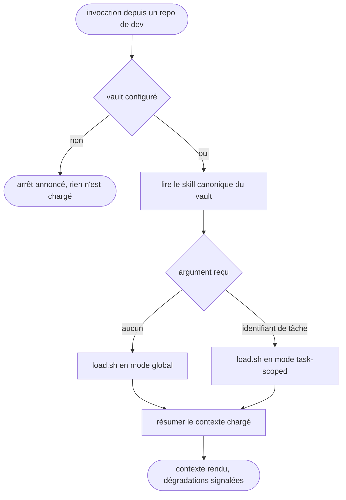

# vault-load — charger le contexte du vault depuis un repo

Passerelle vers le vault Obsidian : le CWD est un repo de dev et jamais le vault, et le skill rend la main dès que le contexte est chargé et résumé.

## Process

1. **Garde.** Vérifier que le vault existe avant toute autre chose.
   - `bash -lc '[ -n "$OBSIDIAN_VAULT_PRO" ] && [ -d "$OBSIDIAN_VAULT_PRO" ] && echo OK'`
   - Sortie autre que `OK` → dire « Vault non configuré (`$OBSIDIAN_VAULT_PRO` absent). J'arrête. » et s'arrêter là.
   - *Pourquoi une garde et pas une hypothèse : cette config tourne aussi sur des postes sans vault.*
2. **Délégation.** Lire et suivre les instructions du skill canonique, `$OBSIDIAN_VAULT_PRO/.agents/skills/load/SKILL.md`.
3. **Lancement.** Lancer le script depuis la racine du vault, jamais depuis le repo.
   - Mode global : `bash -lc 'cd "$OBSIDIAN_VAULT_PRO" && bash scripts/load.sh'`
   - Mode task-scoped : `bash -lc 'cd "$OBSIDIAN_VAULT_PRO" && bash scripts/load.sh <task-id>'`
4. **Résumé.** Rendre à l'utilisateur le contexte chargé : sprint et priorités en mode global, tâche, statut, blockers et next en mode task-scoped.

## Transversal rules

- **Tout chemin se résout contre `$OBSIDIAN_VAULT_PRO`.** Le CWD étant un repo de dev, un chemin relatif pointerait dans le repo et non dans le vault.
- **Aucune dégradation silencieuse.** Identifiant introuvable, lien cassé, script muet : l'anomalie se dit à l'utilisateur au lieu d'être avalée dans le résumé.
- **Le skill ne fait que lire.** Il n'écrit ni dans le vault ni dans le repo courant, d'où l'absence de `disable-model-invocation`.

## Test

Jouable seul, sauf la dernière ligne qui se relit à la main.

| Cas | Preuve |
| --- | --- |
| `bash "$SKILLS_ROOT/_shared/check-vault-bridge.sh" vault-load`, vault en place | `exit 0` : la cible canonique citée au `## Process` résout réellement |
| la même commande, cible canonique renommée ou déplacée | `exit 1` |
| la même commande, vault absent ou `SKILL.md` illisible | `exit 2`, jamais un succès silencieux |
| invocation du skill avec `$OBSIDIAN_VAULT_PRO` vidé | l'arrêt annoncé par la garde, pas un repli sur le repo courant |
