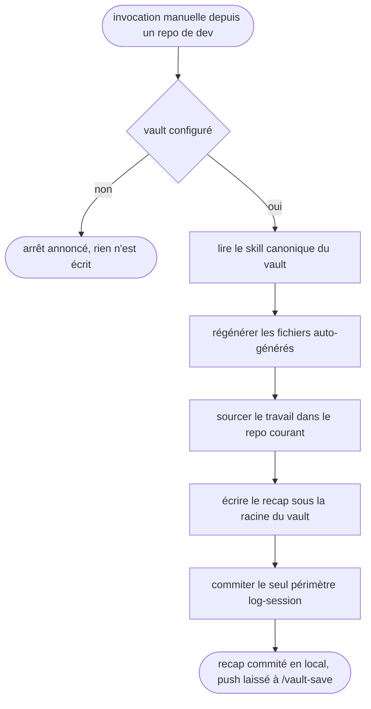

# vault-log-session — journaliser une session dans le vault depuis un repo

Passerelle vers le vault Obsidian : le CWD est un repo de dev et jamais le vault, et le skill rend la main une fois le recap écrit et commité en local.

## Process

1. **Garde.** Vérifier que le vault existe avant toute autre chose.
   - `bash -lc '[ -n "$OBSIDIAN_VAULT_PRO" ] && [ -d "$OBSIDIAN_VAULT_PRO" ] && echo OK'`
   - Sortie autre que `OK` → dire « Vault non configuré (`$OBSIDIAN_VAULT_PRO` absent). J'arrête. » et s'arrêter là.
   - *Pourquoi une garde et pas une hypothèse : cette config tourne aussi sur des postes sans vault.*
2. **Délégation.** Lire et suivre les instructions du skill canonique, `$OBSIDIAN_VAULT_PRO/.agents/skills/log-session/SKILL.md`.
3. **Régénération.** Lancer les scripts depuis la racine du vault, jamais depuis le repo.
   - `bash -lc 'cd "$OBSIDIAN_VAULT_PRO" && bash scripts/vault-stats.sh'`
   - `bash -lc 'cd "$OBSIDIAN_VAULT_PRO" && bash scripts/regen-all.sh "$OBSIDIAN_VAULT_PRO"'`
4. **Source.** Sourcer le travail de la session dans le repo courant, pas dans le vault.
   - `git log`, `git diff` et les fichiers touchés du repo donnent la matière du recap.
5. **Écriture.** Écrire sous la racine absolue du vault, jamais dans le repo courant.
   - recap → `$OBSIDIAN_VAULT_PRO/scripts/logs/sessions/<date>.md`, la date venant de `bash -lc 'date +%F'`
   - décisions et CHANGELOG → `$OBSIDIAN_VAULT_PRO/scripts/logs/`
6. **Commit.** Committer depuis la racine du vault, comme les autres scripts.
   - `bash -lc 'cd "$OBSIDIAN_VAULT_PRO" && bash scripts/commit-log-session.sh "docs(<date>): <titre du recap>"'`
   - Le script ne prend que le périmètre de log-session et ne pousse pas. Pour sauvegarder le vault hors machine, lancer `/vault-save`.

## Transversal rules

- **Tout chemin se résout contre `$OBSIDIAN_VAULT_PRO`.** Le CWD étant un repo de dev, un chemin relatif pointerait dans le repo et non dans le vault.
- **Aucune dégradation silencieuse.** Script muet, régénération partielle, commit vide : l'anomalie se dit à l'utilisateur au lieu d'être avalée dans le recap.
- **Le skill écrit et commite dans le vault**, d'où son `disable-model-invocation: true` et son appel par `/vault-log-session`.

## Test

Jouable seul, sauf la dernière ligne qui se relit à la main.

| Cas | Preuve |
| --- | --- |
| `bash "$SKILLS_ROOT/_shared/check-vault-bridge.sh" vault-log-session`, vault en place | `exit 0` : chaque cible canonique citée au `## Process` résout réellement |
| la même commande, cible canonique renommée ou déplacée | `exit 1` |
| la même commande, vault absent ou `SKILL.md` illisible | `exit 2`, jamais un succès silencieux |
| invocation du skill avec `$OBSIDIAN_VAULT_PRO` vidé | l'arrêt annoncé par la garde, pas une écriture dans le repo courant |
