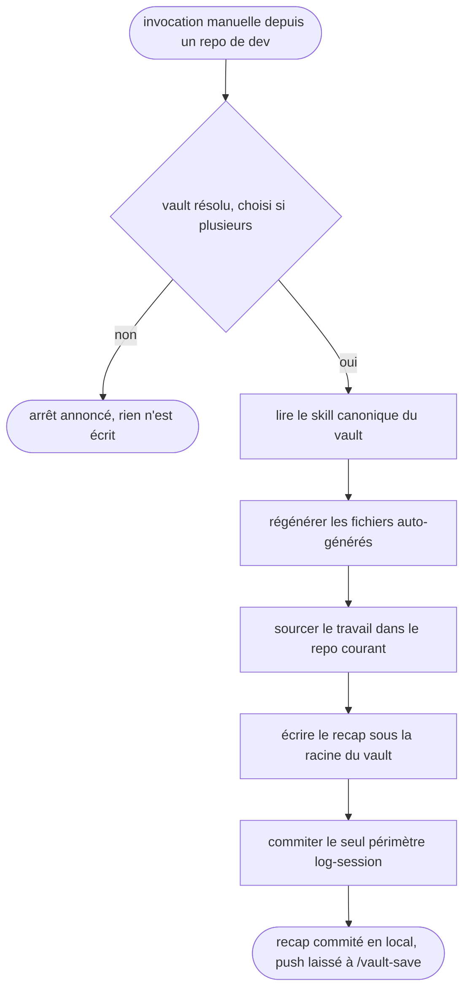

# vault-log-session — journaliser une session dans le vault depuis un repo

Passerelle vers le vault Obsidian : le CWD est un repo de dev et jamais le vault, et le skill rend la main une fois le recap écrit et commité en local.

```mermaid
flowchart TD
  entree([invocation manuelle depuis un repo de dev]) --> garde{vault résolu, choisi si plusieurs}
  garde -->|non| arret([arrêt annoncé, rien n'est écrit])
  garde -->|oui| canonique[lire le skill canonique du vault]
  canonique --> regen[régénérer les fichiers auto-générés]
  regen --> source[sourcer le travail dans le repo courant]
  source --> ecriture[écrire le recap sous la racine du vault]
  ecriture --> commit[commiter le seul périmètre log-session]
  commit --> rendu([recap commité en local, push laissé à /vault-save])
```

## Process

1. **Garde et choix du vault.** Lister les vaults avant toute autre chose, sans supposer lequel existe.
   - `bash -lc 'bash "$SKILLS_ROOT/_shared/resolve-vault.sh"'`
   - `exit 0` → la sortie est le chemin du vault, noté `<vault>` plus bas.
   - `exit 3` → plusieurs vaults. Les proposer à l'utilisateur sous forme numérotée (une ligne `1 PERSO`, `2 PRO`, sans le chemin), lui demander de répondre par le numéro, puis relancer `resolve-vault.sh <numéro>` pour obtenir `<vault>`.
   - `exit 1` → dire « Aucun vault Obsidian configuré (`OBSIDIAN_VAULT_PRO` et `OBSIDIAN_VAULT_PERSO` absents). J'arrête. » et s'arrêter là.
   - *Pourquoi une liste et pas un vault câblé : le même repo tourne sur un poste pro, un poste perso, ou les deux, et chaque poste n'a pas les mêmes vaults.*
2. **Délégation.** Lire et suivre les instructions du skill canonique, `<vault>/.agents/skills/log-session/SKILL.md`.
3. **Régénération.** Lancer les scripts depuis la racine du vault, jamais depuis le repo.
   - `bash -lc 'cd "<vault>" && bash scripts/vault-stats.sh'`
   - `bash -lc 'cd "<vault>" && bash scripts/regen-all.sh "<vault>"'`
4. **Source.** Sourcer le travail de la session dans le repo courant, pas dans le vault.
   - `git log`, `git diff` et les fichiers touchés du repo donnent la matière du recap.
5. **Écriture.** Écrire sous la racine absolue du vault, jamais dans le repo courant.
   - recap → `<vault>/scripts/logs/sessions/<date>.md`, la date venant de `bash -lc 'date +%F'`
   - décisions et CHANGELOG → `<vault>/scripts/logs/`
6. **Commit.** Committer depuis la racine du vault, comme les autres scripts.
   - `bash -lc 'cd "<vault>" && bash scripts/commit-log-session.sh "docs(<date>): <titre du recap>"'`
   - Le script ne prend que le périmètre de log-session et ne pousse pas. Pour sauvegarder le vault hors machine, lancer `/vault-save`.

## Transversal rules

- **Tout chemin se résout contre `<vault>`.** Le CWD étant un repo de dev, un chemin relatif pointerait dans le repo et non dans le vault.
- **Aucune dégradation silencieuse.** Script muet, régénération partielle, commit vide : l'anomalie se dit à l'utilisateur au lieu d'être avalée dans le recap.
- **Le skill écrit et commite dans le vault**, d'où son `disable-model-invocation: true` et son appel par `/vault-log-session`.

## Test

Jouable seul, sauf la dernière ligne qui se relit à la main.

| Cas | Preuve |
| --- | --- |
| `bash "$SKILLS_ROOT/_shared/check-vault-bridge.sh" vault-log-session`, vault en place | `exit 0` : chaque cible canonique citée au `## Process` résout réellement |
| la même commande, cible canonique renommée ou déplacée | `exit 1` |
| la même commande, vault absent ou `SKILL.md` illisible | `exit 2`, jamais un succès silencieux |
| invocation sans `OBSIDIAN_VAULT_PRO` ni `OBSIDIAN_VAULT_PERSO` | l'arrêt annoncé par la garde, rien n'est écrit dans le repo courant |
| invocation avec un seul vault exporté | aucune question posée, le skill travaille dans ce vault |
| invocation avec les deux vaults exportés | la liste numérotée est proposée, et le skill travaille dans celui choisi |
