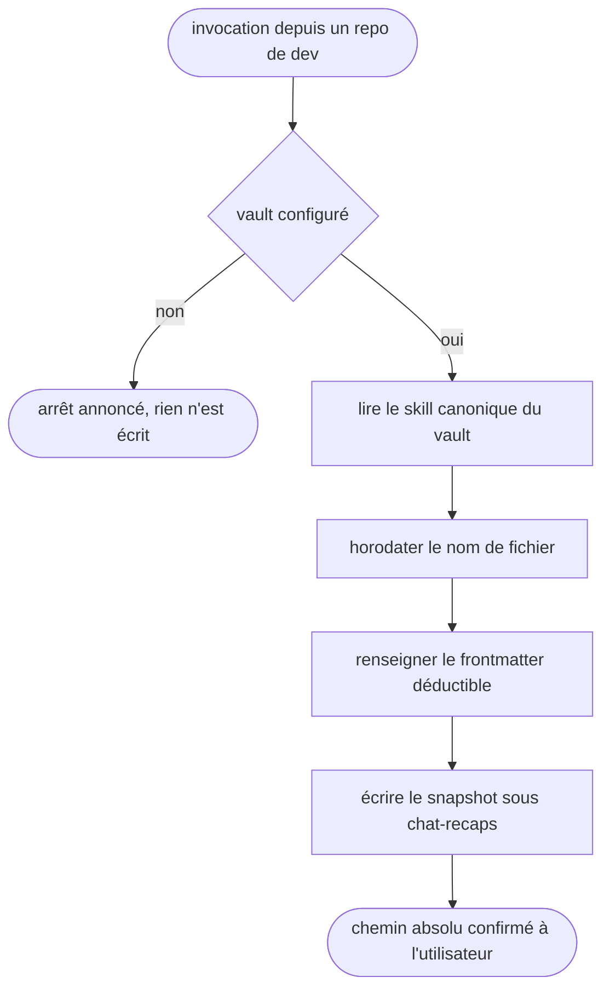

# vault-recap-raisonnement — publier un snapshot de raisonnement dans le vault

Passerelle vers le vault Obsidian : le CWD est un repo de dev et jamais le vault, et le skill rend la main dès que le snapshot est écrit et son chemin confirmé.

## Process

1. **Garde.** Vérifier que le vault existe avant toute autre chose.
   - `bash -lc '[ -n "$OBSIDIAN_VAULT_PRO" ] && [ -d "$OBSIDIAN_VAULT_PRO" ] && echo OK'`
   - Sortie autre que `OK` → dire « Vault non configuré (`$OBSIDIAN_VAULT_PRO` absent). J'arrête. » et s'arrêter là.
   - *Pourquoi une garde et pas une hypothèse : cette config tourne aussi sur des postes sans vault.*
2. **Délégation.** Lire et suivre les instructions du skill canonique, `$OBSIDIAN_VAULT_PRO/.agents/skills/recap-raisonnement/SKILL.md`.
3. **Horodatage.** Dater le nom de fichier avec `bash -lc 'date "+%Y-%m-%d-%H%M"'`, jamais avec une date déduite du contexte.
4. **Métadonnées.** Renseigner `session_id`, `session_path` et `project` dans le frontmatter du snapshot, à partir du chemin du scratchpad et du CWD du repo.
   - Champ indéductible → le laisser vide plutôt que l'inventer.
5. **Confirmation.** Rendre à l'utilisateur le chemin absolu du fichier créé.

## Transversal rules

- **Tout chemin se résout contre `$OBSIDIAN_VAULT_PRO`.** Le snapshot se crée dans `$OBSIDIAN_VAULT_PRO/chat-recaps/<sujet>/`. Le CWD étant un repo de dev, un chemin relatif écrirait dans le repo au lieu du vault.
- **Aucune dégradation silencieuse.** Sujet introuvable, lien cassé, script muet : l'anomalie se dit à l'utilisateur au lieu d'être avalée dans la confirmation.

## Test

Jouable seul, sauf la dernière ligne qui se relit à la main.

| Cas | Preuve |
| --- | --- |
| `bash "$SKILLS_ROOT/_shared/check-vault-bridge.sh" vault-recap-raisonnement`, vault en place | `exit 0` : la cible canonique citée au `## Process` résout réellement |
| la même commande, cible canonique renommée ou déplacée | `exit 1` |
| la même commande, vault absent ou `SKILL.md` illisible | `exit 2`, jamais un succès silencieux |
| invocation du skill avec `$OBSIDIAN_VAULT_PRO` vidé | l'arrêt annoncé par la garde, pas une écriture dans le repo courant |
