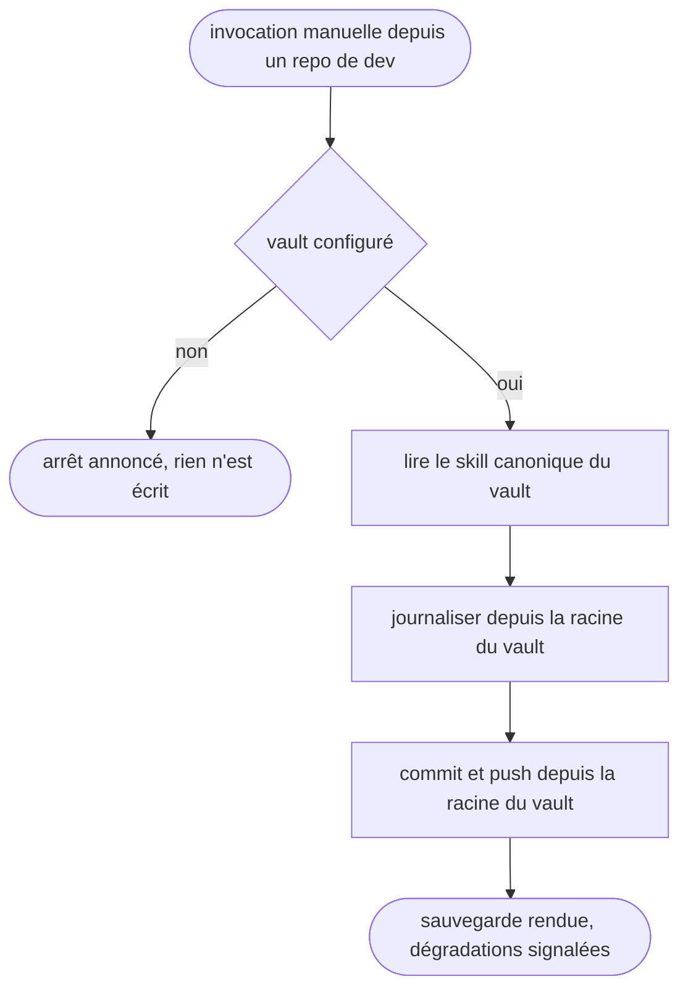

# vault-save — sauvegarder le vault depuis un repo

Passerelle vers le vault Obsidian : le CWD est un repo de dev et jamais le vault, et le skill rend la main une fois le vault journalisé, committé et poussé.

## Process

1. **Garde.** Vérifier que le vault existe avant toute autre chose.
   - `bash -lc '[ -n "$OBSIDIAN_VAULT_PRO" ] && [ -d "$OBSIDIAN_VAULT_PRO" ] && echo OK'`
   - Sortie autre que `OK` → dire « Vault non configuré (`$OBSIDIAN_VAULT_PRO` absent). J'arrête. » et s'arrêter là.
   - *Pourquoi une garde et pas une hypothèse : cette config tourne aussi sur des postes sans vault.*
2. **Délégation.** Lire et suivre les instructions du skill canonique, `$OBSIDIAN_VAULT_PRO/.agents/skills/save/SKILL.md`.
   - Il enchaîne lui-même la journalisation puis le commit et le push. Le pont ne rejoue ni ses étapes ni son format de message.
3. **Lancement.** Lancer chaque script depuis la racine du vault, jamais depuis le repo courant.
   - `bash -lc 'cd "$OBSIDIAN_VAULT_PRO" && bash scripts/<script>.sh'`
   - *Pourquoi le `cd` : les scripts du vault résolvent leurs chemins contre le CWD, qui est ici un repo de dev.*
4. **Source externe.** Sourcer le recap depuis le repo courant, `git log` et `git diff`, fichiers touchés.
   - L'écriture, elle, part sous `$OBSIDIAN_VAULT_PRO` : c'est le vault qui garde la trace, pas le repo.
5. **Rendu.** Dire à l'utilisateur ce qui a été écrit, ce qui a été committé et si le push est passé.

## Transversal rules

- **Tout chemin se résout contre `$OBSIDIAN_VAULT_PRO`.** Le CWD étant un repo de dev, un chemin relatif écrirait dans le repo et non dans le vault.
- **Le contenu de la sauvegarde appartient au skill canonique.** Le pont ne porte que la résolution des chemins et la source externe du recap. Recopier ici le format du message de commit ou la liste des scripts en ferait une deuxième version, qui dérive au premier edit de l'autre.
- **Aucune dégradation silencieuse.** Script muet, commit vide, push refusé : l'anomalie se dit à l'utilisateur au lieu d'être avalée dans le compte rendu.
- **Le skill écrit, commit et pousse**, d'où `disable-model-invocation: true` et l'appel par `/vault-save`.

## Test

Jouable seul, sauf la dernière ligne qui se relit à la main.

| Cas | Preuve |
| --- | --- |
| `bash "$SKILLS_ROOT/_shared/check-vault-bridge.sh" vault-save`, vault en place | `exit 0` : la cible canonique citée au `## Process` résout réellement |
| la même commande, cible canonique renommée ou déplacée | `exit 1` |
| la même commande, vault absent ou `SKILL.md` illisible | `exit 2`, jamais un succès silencieux |
| invocation du skill avec `$OBSIDIAN_VAULT_PRO` vidé | l'arrêt annoncé par la garde, pas un commit dans le repo courant |
