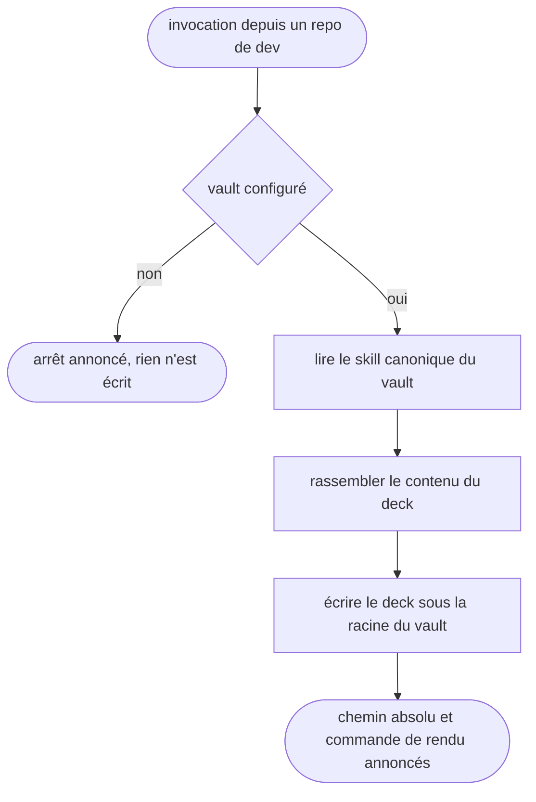

# vault-slides — générer un deck Slidev dans le vault depuis un repo

Passerelle vers le vault Obsidian : le CWD est un repo de dev et jamais le vault, et le skill rend la main dès que le deck est écrit et son chemin annoncé.

## Process

1. **Garde.** Vérifier que le vault existe avant toute autre chose.
   - `bash -lc '[ -n "$OBSIDIAN_VAULT_PRO" ] && [ -d "$OBSIDIAN_VAULT_PRO" ] && echo OK'`
   - Sortie autre que `OK` → dire « Vault non configuré (`$OBSIDIAN_VAULT_PRO` absent). J'arrête. » et s'arrêter là.
   - *Pourquoi une garde et pas une hypothèse : cette config tourne aussi sur des postes sans vault.*
2. **Délégation.** Lire et suivre les instructions du skill canonique, `$OBSIDIAN_VAULT_PRO/.agents/skills/slides/SKILL.md`.
3. **Source.** Rassembler le contenu du deck.
   - Contenu venant du repo courant : le lire depuis le CWD, sans jamais y écrire.
4. **Écriture.** Créer le deck dans `$OBSIDIAN_VAULT_PRO/2_PROJECTS/<projet>/slides/`.
   - Date du nom de fichier : `bash -lc 'date +%F'`.
5. **Rendu.** Confirmer à l'utilisateur le chemin absolu créé, puis la commande qui rend le deck.

## Transversal rules

- **Tout chemin se résout contre `$OBSIDIAN_VAULT_PRO`.** Le CWD étant un repo de dev, un chemin relatif écrirait le deck dans le repo au lieu du vault.
- **Le repo courant reste en lecture seule.** Il sert de source de contenu, jamais de destination.
- **Aucune dégradation silencieuse.** Projet de destination introuvable, source vide, script muet : l'anomalie se dit à l'utilisateur au lieu d'être avalée dans la confirmation.

## Test

Jouable seul, sauf la dernière ligne qui se relit à la main.

| Cas | Preuve |
| --- | --- |
| `bash "$SKILLS_ROOT/_shared/check-vault-bridge.sh" vault-slides`, vault en place | `exit 0` : la cible canonique citée au `## Process` résout réellement |
| la même commande, cible canonique renommée ou déplacée | `exit 1` |
| la même commande, vault absent ou `SKILL.md` illisible | `exit 2`, jamais un succès silencieux |
| invocation du skill avec `$OBSIDIAN_VAULT_PRO` vidé | l'arrêt annoncé par la garde, pas un deck écrit dans le repo courant |
