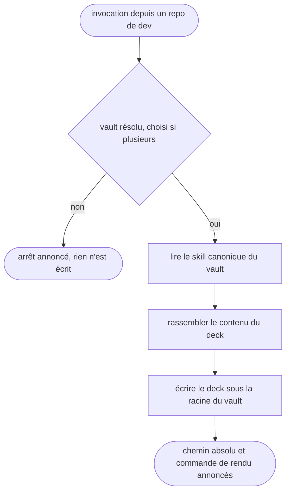

# vault-slides — générer un deck Slidev dans le vault depuis un repo

Passerelle vers le vault Obsidian : le CWD est un repo de dev et jamais le vault, et le skill rend la main dès que le deck est écrit et son chemin annoncé.

```mermaid
flowchart TD
  entree([invocation depuis un repo de dev]) --> garde{vault résolu, choisi si plusieurs}
  garde -->|non| arret([arrêt annoncé, rien n'est écrit])
  garde -->|oui| canonique[lire le skill canonique du vault]
  canonique --> contenu[rassembler le contenu du deck]
  contenu --> deck[écrire le deck sous la racine du vault]
  deck --> rendu([chemin absolu et commande de rendu annoncés])
```

## Process

1. **Garde et choix du vault.** Lister les vaults avant toute autre chose, sans supposer lequel existe.
   - `bash -lc 'bash "$SKILLS_ROOT/_shared/resolve-vault.sh"'`
   - `exit 0` → la sortie est le chemin du vault, noté `<vault>` plus bas.
   - `exit 3` → plusieurs vaults. Les proposer à l'utilisateur sous forme numérotée (une ligne `1 PERSO`, `2 PRO`, sans le chemin), lui demander de répondre par le numéro, puis relancer `resolve-vault.sh <numéro>` pour obtenir `<vault>`.
   - `exit 1` → dire « Aucun vault Obsidian configuré (`OBSIDIAN_VAULT_PRO` et `OBSIDIAN_VAULT_PERSO` absents). J'arrête. » et s'arrêter là.
   - *Pourquoi une liste et pas un vault câblé : le même repo tourne sur un poste pro, un poste perso, ou les deux, et chaque poste n'a pas les mêmes vaults.*
2. **Délégation.** Lire et suivre les instructions du skill canonique, `<vault>/.agents/skills/slides/SKILL.md`.
3. **Source.** Rassembler le contenu du deck.
   - Contenu venant du repo courant : le lire depuis le CWD, sans jamais y écrire.
4. **Écriture.** Créer le deck dans `<vault>/2_PROJECTS/<projet>/slides/`.
   - Date du nom de fichier : `bash -lc 'date +%F'`.
5. **Rendu.** Confirmer à l'utilisateur le chemin absolu créé, puis la commande qui rend le deck.

## Transversal rules

- **Tout chemin se résout contre `<vault>`.** Le CWD étant un repo de dev, un chemin relatif écrirait le deck dans le repo au lieu du vault.
- **Le repo courant reste en lecture seule.** Il sert de source de contenu, jamais de destination.
- **Aucune dégradation silencieuse.** Projet de destination introuvable, source vide, script muet : l'anomalie se dit à l'utilisateur au lieu d'être avalée dans la confirmation.

## Test

Jouable seul, sauf la dernière ligne qui se relit à la main.

| Cas | Preuve |
| --- | --- |
| `bash "$SKILLS_ROOT/_shared/check-vault-bridge.sh" vault-slides`, vault en place | `exit 0` : la cible canonique citée au `## Process` résout réellement |
| la même commande, cible canonique renommée ou déplacée | `exit 1` |
| la même commande, vault absent ou `SKILL.md` illisible | `exit 2`, jamais un succès silencieux |
| invocation sans `OBSIDIAN_VAULT_PRO` ni `OBSIDIAN_VAULT_PERSO` | l'arrêt annoncé par la garde, rien n'est écrit dans le repo courant |
| invocation avec un seul vault exporté | aucune question posée, le skill travaille dans ce vault |
| invocation avec les deux vaults exportés | la liste numérotée est proposée, et le skill travaille dans celui choisi |
